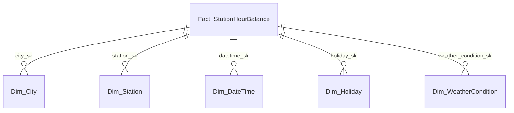
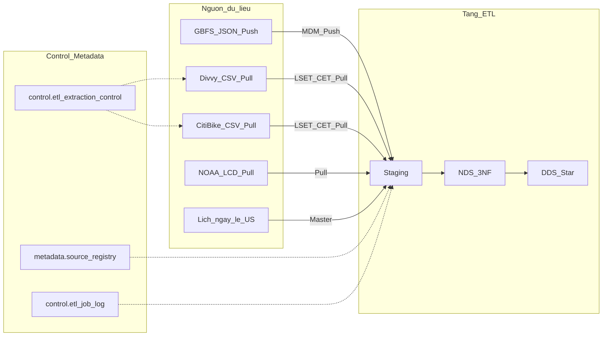

# Đề tài chính thức: Phân tích điều phối và nhu cầu hệ thống xe đạp chia sẻ

**Trạng thái:** Chính thức  
**Lược đồ DDS:** Star schema (một fact)  
**Phạm vi:** Chicago (Divvy) + New York (Citi Bike)  
**Cập nhật:** 2026-06-28  

**Tài liệu liên quan:** [topic_exploration_v2.md](topic_exploration_v2.md) (khám phá và validate dataset), [2_Guidelines/README.md](../2_Guidelines/README.md) (yêu cầu môn học).

---

## Mục lục

1. [Vai trò quản lý là gì?](#1-vai-trò-quản-lý-là-gì)
2. [Chức năng nghiệp vụ của vai trò](#2-chức-năng-nghiệp-vụ-của-vai-trò)
3. [Sử dụng lược đồ gì?](#3-sử-dụng-lược-đồ-gì)
4. [Kiến trúc Data Warehouse dự kiến](#4-kiến-trúc-data-warehouse-dự-kiến)
5. [Dataset sử dụng](#5-dataset-sử-dụng)
6. [Bảng Fact và Dimension dự kiến](#6-bảng-fact-và-dimension-dự-kiến)
7. [Fact và Dimension phục vụ nghiệp vụ](#7-fact-và-dimension-phục-vụ-nghiệp-vụ)

---

## 1. Vai trò quản lý là gì?

**Trưởng phòng Điều phối Xe đạp công cộng** (Head of Shared Bike Fleet Dispatch).

Đây là vai trò quản lý cấp cao duy nhất sử dụng kho dữ liệu hàng ngày để ra quyết định điều phối đội xe giữa các trạm và giữa hai thị trường Chicago và New York. Người này không vận hành trực tiếp từng chuyến đi trên app, mà cần bức tranh tổng hợp theo giờ, theo trạm và theo thành phố để lập kế hoạch tuần, phân bổ xe tải và điều chỉnh nhân sự theo mùa.

---

## 2. Chức năng nghiệp vụ của vai trò

Mỗi tuần, Trưởng phòng Điều phối cần trả lời các câu hỏi sau:

| Câu hỏi nghiệp vụ | Hướng phân tích |
|--------------------|-----------------|
| Trạm nào đang thiếu xe, trạm nào đang thừa? | `net_flow`, `abs_imbalance` theo `Dim_Station` × `Dim_DateTime` |
| Khu vực / thành phố nào quá tải vào giờ cao điểm? | `trips_started`, `trips_ended` theo `Dim_City`, cờ `is_peak_hour` |
| Thời tiết, ngày lễ, giờ trong ngày ảnh hưởng nhu cầu ra sao? | So sánh measure chuyến đi khi mưa / nắng, ngày lễ / ngày thường |
| Mùa đông / mùa hè cần bao nhiêu nhân sự cân bằng? | Xu hướng theo `season` trên `Dim_DateTime` |
| Thành viên (member) và khách vãng lai (casual) dùng xe khác nhau thế nào? | `member_trip_count` so với `casual_trip_count` |
| Xe điện và xe cơ chiếm tỷ trọng bao nhiêu từng trạm? | `electric_trip_count`, `classic_trip_count` |

Các nghiệp vụ trên đòi hỏi gom dữ liệu từ nhiều nguồn (trip CSV hai hệ thống, thời tiết NOAA, danh mục trạm GBFS) và cho phép drill từ thành phố xuống trạm, từ tuần xuống giờ. OLTP của nhà vận hành chỉ phục vụ giao dịch từng chuyến; không đủ cho báo cáo lịch sử đa nguồn như vậy.

---

## 3. Sử dụng lược đồ gì?

### 3.1. Lựa chọn: Star schema

DDS dùng **Star schema** với **một** bảng fact trung tâm: `Fact_StationHourBalance`, bao quanh bởi năm bảng dimension.

Trong giai đoạn khám phá ([topic_exploration_v2.md](topic_exploration_v2.md)), nhóm từng xem xét Galaxy schema (nhiều fact: trip, cân bằng trạm, thời tiết riêng). Đề tài chính thức **không** dùng Galaxy vì Trưởng phòng Điều phối chủ yếu cần snapshot theo giờ tại trạm; trip chi tiết được gom trong ETL/NDS, không đưa thêm fact transaction vào DDS.

### 3.2. Fact Type

| Loại fact (Kimball) | Áp dụng cho đề tài này? | Giải thích |
|---------------------|-------------------------|------------|
| Transactional Fact | Không | Grain không phải một dòng một chuyến đi. |
| **Periodic Snapshot Fact** | **Có** | Mỗi dòng là ảnh chụp tổng hợp **theo giờ** cho một trạm trong một thành phố: số chuyến bắt đầu/kết thúc, net flow, phân rã loại người dùng và loại xe. |
| Accumulating Snapshot Fact | Không | Không theo dõi các mốc của một quy trình đơn lẻ (ví dụ một chuyến xe tải từ lúc rời depot đến khi hoàn tất). |

Trip CSV vẫn là dữ liệu **giao dịch** ở Staging và NDS. DDS chỉ lưu **snapshot định kỳ** phục vụ OLAP.

### 3.3. Measure thời tiết và Degenerate Dimension

Theo Kimball:

- `temperature`, `precipitation`, `wind_speed` trên fact là **measure (số đo)**, thường **semi-additive**. Chúng được denormalize từ NOAA khi load để dashboard không phải join lại bảng thời tiết từng lần truy vấn.
- `weather_condition_sk` trỏ tới `Dim_WeatherCondition` là **dimension thường** (FK), dùng để slice/dice theo nhóm Clear / Rain / Snow.
- **Degenerate Dimension (chiều suy biến)** là thuộc tính phi số hoặc mã nằm trên fact **không** có bảng dimension riêng (ví dụ mã file nguồn `source_file_month` dạng `YYYY-MM` nếu nhóm bổ sung). Các cột nhiệt độ / mưa / gió **không** thuộc loại này.

### 3.4. Sơ đồ Star (tổng quan)

### Mã Mermaid (copy-paste)

---

## 4. Kiến trúc Data Warehouse dự kiến

### 4.1. Luồng tổng thể

Dữ liệu đi qua các tầng: **Nguồn → Staging → NDS (3NF) → DDS (Star) → Cube / Power BI**.

### Mã Mermaid (copy-paste)

### 4.2. Vai trò từng tầng

| Tầng | Nội dung đề tài xe đạp |
|------|-------------------------|
| Staging | CSV thô Divvy/Citi; snapshot JSON GBFS; CSV NOAA; lịch ngày lễ US; `batch_id`, ít ràng buộc, firewall DQ |
| NDS (3NF) | `city`, `station`, `trip`, `weather_observation`, `calendar_day`, `holiday`; upsert, surrogate key, load master trước transaction |
| DDS (Star) | `Fact_StationHourBalance` + 5 dimension; load dimension trước fact |
| Cube / BI | Power BI hoặc SSAS: slice, dice, drill down/up |

### 4.3. ETL hybrid: GBFS Push và trip Pull

| Cơ chế | Nguồn | Mục đích |
|--------|-------|----------|
| **Push (MDM)** | GBFS `station_information.json` | Cập nhật master trạm (`Dim_Station`) khi trạm mới, đổi tên, đổi capacity |
| **Pull (LSET/CET)** | Divvy, Citi Bike ZIP theo tháng | Giao dịch chuyến đi; incremental theo `started_at` |
| **Pull** | NOAA LCD theo file năm | Quan trắc thời tiết theo giờ, gắn thành phố |
| **Master** | Lịch ngày lễ US | `Dim_Holiday` |

**GBFS** (General Bikeshare Feed Specification) là chuẩn JSON cho dữ liệu bike-share thời gian thực. `station_information` mô tả danh mục trạm; `station_status` mô tả số xe/dock trống tại thời điểm quan sát. Trong dự án, có thể mô phỏng Push bằng cách ghi snapshot JSON vào staging qua Hop Web Service (cùng hướng MDM demo trong [3_Hop_ETL_Test](../3_Hop_ETL_Test/)).

Lý do Push cho master thay vì chỉ Pull file trip hàng tháng: trạm có thể đổi bất kỳ ngày nào; trip tham chiếu `station_id` sẽ gặp **late-arriving dimension** nếu danh mục trạm chưa kịp cập nhật.

### 4.4. Bảng control và metadata

Tham chiếu schema mẫu: [03_control_schema.sql](../3_Hop_ETL_Test/docker/dw-stg-postgres/03_control_schema.sql), [04_metadata_schema.sql](../3_Hop_ETL_Test/docker/dw-stg-postgres/04_metadata_schema.sql).

#### `metadata.source_registry`

Đăng ký danh mục nguồn logic mà ETL biết cách kết nối.

| Cột | Ý nghĩa |
|-----|---------|
| `source_name` (PK) | Mã nguồn, ví dụ `divvy_trips`, `citibike_trips`, `noaa_lcd`, `gbfs_station` |
| `source_type` | Loại kỹ thuật: `s3_csv`, `json_push`, `file_pull` |
| `connection_ref` | Tham chiếu cấu hình Hop hoặc URL bucket |
| `notes` | Ghi chú Push/Pull, tần suất |

#### `control.etl_extraction_control`

Theo dõi cửa sổ trích xuất incremental (**LSET** / **CET**) cho từng cặp nguồn và bảng staging.

| Cột | Ý nghĩa |
|-----|---------|
| `source_name`, `table_name` | Nguồn và bảng staging đích |
| `lset` | Last Successful Extraction Time |
| `cet` | Current Extraction Time |
| `last_run_status` | `SUCCESS` / `FAILED` |
| `rows_extracted` | Số dòng lần chạy gần nhất |
| `updated_at` | Thời điểm cập nhật bản ghi control |

#### `control.etl_job_log`

Nhật ký từng lần chạy pipeline/workflow.

| Cột | Ý nghĩa |
|-----|---------|
| `job_name` | Tên job Hop |
| `source_name` | Nguồn liên quan (nếu có) |
| `started_at`, `finished_at` | Thời gian chạy |
| `status` | Trạng thái hoàn thành |
| `rows_processed` | Số dòng xử lý |
| `error_message` | Chi tiết lỗi khi thất bại |

#### Ánh xạ nguồn đề tài (seed dự kiến)

| source_name | table_name | Push/Pull | Ghi chú LSET/CET |
|-------------|------------|-----------|------------------|
| `divvy_trips` | `stg_divvy_trips` | Pull | Theo `started_at` trong ZIP tháng |
| `citibike_trips` | `stg_citibike_trips` | Pull | Tương tự Divvy |
| `noaa_lcd` | `stg_weather_lcd` | Pull | Theo file năm/tháng |
| `gbfs_station` | `stg_gbfs_station` | Push | Snapshot time / `updated_at`, không dùng LSET kiểu trip |

Ba bảng trên giúp nhóm quản lý lịch sử ETL, giá trị LSET/CET, và chứng minh cơ chế hybrid Push/Pull (kể cả kịch bản bonus: master GBFS tới trước hoặc sau batch trip).

### 4.5. Xử lý dữ liệu đến muộn

| Tình huống | Cách xử lý | SCD / kỹ thuật |
|------------|------------|----------------|
| Chuyến đi tới sau khi đã load snapshot giờ đó | Tái tổng hợp dòng fact theo grain | Upsert measure trên fact; **không** SCD trên fact |
| Trạm mới trong trip, chưa có trong GBFS | Skeleton trạm hoặc giữ staging | **SCD Type 2** trên `Dim_Station` (hoặc skeleton theo [2_Guidelines](../2_Guidelines/README.md) §3.5.1) |
| Đổi tên / tọa độ / capacity trạm | Bản ghi dimension mới | **SCD Type 2** `Dim_Station` |
| NOAA đến muộn cho giờ đã load | Cập nhật measure thời tiết trên cùng grain | Upsert fact |
| Sửa rule nhóm thời tiết | Ghi đè lookup | **SCD Type 1** `Dim_WeatherCondition` |

**Nguyên tắc:** SCD áp dụng cho **dimension**. Fact periodic snapshot dùng insert/upsert theo grain.

---

## 5. Dataset sử dụng

Đề tài dùng **ba nguồn dữ liệu chính** (đủ điều kiện môn học) cộng **GBFS** làm master Push. Cả ba nguồn chính đã được kiểm tra tải xuống (2026-06-28).

### 5.1. Divvy Trip Data (Chicago)

| Hạng mục | Chi tiết |
|----------|----------|
| Vai trò | Giao dịch chuyến đi (Pull) |
| Định dạng | CSV trong ZIP theo tháng |
| Tải về | [divvybikes.com/system-data](https://divvybikes.com/system-data) → `https://divvy-tripdata.s3.amazonaws.com/` (ví dụ `202406-divvy-tripdata.zip`) |
| Trường chính | `ride_id`, `started_at`, `ended_at`, `start_station_id`, `end_station_id`, `member_casual`, `rideable_type`, lat/lng |
| Grain nguồn | Một dòng một chuyến đi |
| Độ bẩn / ETL | Một số dòng dockless để trống tên trạm; schema đổi theo năm; cần chuẩn hóa timezone Chicago |

### 5.2. Citi Bike Trip Histories (New York)

| Hạng mục | Chi tiết |
|----------|----------|
| Vai trò | Giao dịch chuyến đi (Pull), hệ thống thứ hai cho đa thành phố |
| Định dạng | CSV trong ZIP theo tháng (file lớn, có thể tách nhiều CSV trong một ZIP) |
| Tải về | [citibikenyc.com/system-data](https://citibikenyc.com/system-data) → `https://s3.amazonaws.com/tripdata/` (ví dụ `202406-citibike-tripdata.zip`) |
| Trường chính | Tương tự Divvy; tên cột có thể khác theo năm |
| Grain nguồn | Một dòng một chuyến đi |
| Độ bẩn / ETL | `station_id` **không** dùng chung với Divvy; join xuyên thành phố chỉ qua `Dim_City`, không qua `station_id` |

### 5.3. NOAA NCEI Local Climatological Data (LCD)

| Hạng mục | Chi tiết |
|----------|----------|
| Vai trò | Thời tiết theo giờ (Pull) |
| Định dạng | CSV rộng (nhiều cột), bulk theo năm |
| Tải về | [ncei.noaa.gov/data/local-climatological-data/access/](https://www.ncei.noaa.gov/data/local-climatological-data/access/) |
| Trạm Chicago | File `72534014819.csv` (CHICAGO MIDWAY AIRPORT, IL US) |
| Trạm New York | File `72505394728.csv` (NY CITY CENTRAL PARK, NY US) |
| Trường map ETL | `HourlyDryBulbTemperature`, `HourlyPrecipitation`, `HourlyWindSpeed` (tên cột trong file LCD) |
| Khóa join | `city_code` + `date_hour` (cắt `started_at`/`ended_at` về giờ, timezone theo thành phố) |

### 5.4. GBFS (master, Push)

| Hạng mục | Chi tiết |
|----------|----------|
| Vai trò | Master trạm (`Dim_Station`), không tính là nguồn giao dịch thứ tư |
| Feed chính | `station_information.json`; tùy chọn `station_status.json` cho KPI vận hành |
| Liên kết | Trang system-data của Divvy và Citi Bike |
| Khóa join | `city_sk` + `source_station_id` (mã trạm trong từng hệ thống) |

### 5.5. Khóa join giữa các nguồn

| Cặp nguồn | Khóa join | Kết quả |
|-----------|-----------|---------|
| Divvy ↔ Citi Bike | `city_sk` (union fact sau ETL) | Hợp lệ đa thành phố |
| Trip ↔ NOAA | `city_code` + `date_hour` | Hợp lệ |
| Trip ↔ GBFS | `city_sk` + `source_station_id` | Hợp lệ trong từng thành phố |
| Divvy station ↔ Citi station | `station_id` trực tiếp | **Không** hợp lệ (hai namespace khác nhau) |

**Khuyến nghị triển khai:** chọn cùng một tháng ở hai thành phố (ví dụ `2024-06`) và file NOAA cùng năm để so sánh công bằng.

---

## 6. Bảng Fact và Dimension dự kiến

### 6.1. Fact grain

**Fact grain:** Mỗi dòng trong `Fact_StationHourBalance` đại diện cho đúng một tổ hợp **một thành phố × một trạm × một giờ lịch** (calendar hour, timezone theo thành phố), và chứa các measure tổng hợp mọi chuyến đi có `started_at` hoặc `ended_at` rơi vào giờ đó tại trạm tương ứng.

| Khóa | Mô tả |
|------|--------|
| Business key | `(city_code, source_station_id, date_hour_local)` |
| Surrogate PK | `station_hour_balance_sk` |
| Foreign keys | `city_sk`, `station_sk`, `datetime_sk`, `holiday_sk`, `weather_condition_sk` |

### 6.2. `Fact_StationHourBalance` (Periodic Snapshot)

| Cột | Loại | Nguồn / công thức | Tính chất additive |
|-----|------|-------------------|-------------------|
| `station_hour_balance_sk` | PK | Surrogate | |
| `city_sk` | FK | `Dim_City` | |
| `station_sk` | FK | `Dim_Station` | |
| `datetime_sk` | FK | `Dim_DateTime` | |
| `holiday_sk` | FK | `Dim_Holiday` | |
| `weather_condition_sk` | FK | `Dim_WeatherCondition` | |
| `trips_started` | Measure | COUNT chuyến có `start_station` = trạm trong giờ | Additive |
| `trips_ended` | Measure | COUNT chuyến có `end_station` = trạm trong giờ | Additive |
| `net_flow` | Measure | `trips_started - trips_ended` | Semi-additive |
| `abs_imbalance` | Measure | `ABS(net_flow)` | Semi-additive |
| `member_trip_count` | Measure | COUNT `member_casual = member` (gom start hoặc theo rule nhóm) | Additive |
| `casual_trip_count` | Measure | COUNT `member_casual = casual` | Additive |
| `electric_trip_count` | Measure | COUNT `rideable_type = electric_bike` | Additive |
| `classic_trip_count` | Measure | COUNT xe cơ / docked | Additive |
| `avg_duration_minutes` | Measure | AVG(`ended_at - started_at`) trong giờ tại trạm | Semi-additive (AVG khi roll-up) |
| `temperature` | Measure | NOAA `HourlyDryBulbTemperature` tại giờ, theo thành phố | Semi-additive (AVG) |
| `precipitation` | Measure | NOAA `HourlyPrecipitation` | Semi-additive (AVG/SUM tùy báo cáo) |
| `wind_speed` | Measure | NOAA `HourlyWindSpeed` | Semi-additive (AVG) |

### 6.3. Dimension tables và SCD

| Bảng | SCD | Thuộc tính chính |
|------|-----|------------------|
| `Dim_City` | Type 1 (static) | `city_sk`, `city_code` (CHI, NYC), `city_name`, `timezone`, `noaa_station_id`, `gbfs_system_id` |
| `Dim_Station` | **Type 2** | `station_sk`, `city_sk`, `source_station_id`, `station_name`, `latitude`, `longitude`, `capacity`, `is_active`, `effective_from`, `effective_to`, `is_current` |
| `Dim_DateTime` | Không SCD | `datetime_sk`, `date`, `hour`, `day_of_week`, `is_weekend`, `is_peak_hour`, `month`, `season` |
| `Dim_WeatherCondition` | Type 1 | `weather_condition_sk`, `weather_category` (Clear/Rain/Snow/Fog), `precipitation_band` |
| `Dim_Holiday` | Type 1 (static) | `holiday_sk`, `calendar_date`, `holiday_name`, `is_federal_holiday`, `country_code` |

**Lý do SCD Type 2 cho `Dim_Station`:** GBFS có thể đổi tên trạm, tọa độ, capacity hoặc ngừng hoạt động. Lịch sử phân tích cần biết trạm tại thời điểm chuyến đi diễn ra.

### 6.4. NDS logic (tham chiếu, chưa DDL đầy đủ)

Bảng master NDS dự kiến: `city`, `station`, `calendar_day`, `holiday`, `weather_observation`. Bảng transaction: `trip` (chi tiết chuyến). ETL aggregate từ `trip` + `weather_observation` sang fact DDS.

---

## 7. Fact và Dimension phục vụ nghiệp vụ

| Nghiệp vụ (mục 2) | Measure trên fact | Dimension | Ví dụ OLAP |
|-------------------|-------------------|-----------|------------|
| Trạm thiếu xe | `net_flow < 0`, `abs_imbalance` | `Dim_Station`, `Dim_DateTime` | TOP 10 trạm theo `abs_imbalance` tuần trước |
| Khu vực quá tải | `trips_started`, `net_flow` | `Dim_City`, `is_peak_hour` | SUM theo thành phố × giờ cao điểm |
| Ảnh hưởng thời tiết | `temperature`, `precipitation`, trip counts | `Dim_WeatherCondition` | AVG `trips_started` giờ mưa vs nắng |
| Ngày lễ / giờ cao điểm | toàn bộ measure chuyến | `Dim_Holiday`, `Dim_DateTime` | So sánh ngày lễ vs ngày thường cùng `hour` |
| Member vs casual | `member_trip_count`, `casual_trip_count` | `Dim_City`, `season` | Tỷ lệ member theo tháng |
| Xe điện vs cơ | `electric_trip_count`, `classic_trip_count` | `Dim_Station` | Cơ cấu nhu cầu theo trạm |
| Lập kế hoạch mùa | `trips_started` xu hướng | `Dim_DateTime.season`, `Dim_City` | Drill năm → quý → tháng theo thành phố |
| Đối chiếu Chicago vs NYC | các measure | `Dim_City` | Pivot hai thành phố cùng `datetime_sk` (cùng tháng mẫu) |

Trưởng phòng Điều phối không cần join fact với fact: mọi KPI trên một bảng `Fact_StationHourBalance` đã gom trip, thời tiết số và khóa tới dimension ngày lễ / nhóm thời tiết.

---

## Phụ lục: Quyết định chính thức

| Hạng mục | Quyết định |
|----------|------------|
| Đề tài | Category 2: Điều phối xe đạp chia sẻ đa thành phố |
| Lược đồ DDS | Star schema, một fact |
| Fact | `Fact_StationHourBalance`, Periodic Snapshot |
| Phạm vi địa lý | Chicago (Divvy) + NYC (Citi Bike) |
| ETL | GBFS Push (MDM) + trip/NOAA Pull (LSET/CET) |
| Tháng mẫu đề xuất | `2024-06` (cả hai thành phố) |
| Khám phá trước đó | [topic_exploration_v2.md](topic_exploration_v2.md) |

---

*HCMUS Master IS, Advanced Business Intelligence. Tài liệu đề tài chính thức.*
