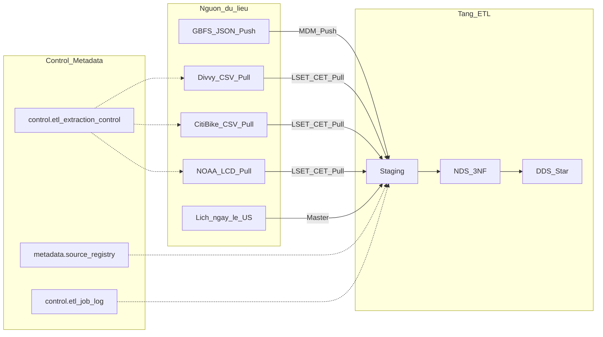
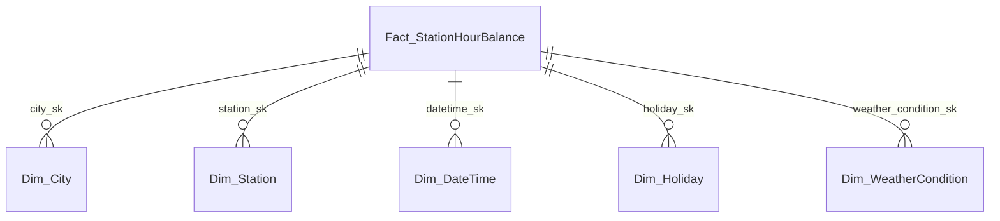

# Đề tài chính thức: Phân tích điều phối và nhu cầu hệ thống xe đạp chia sẻ

**Trạng thái:** Chính thức  
**Lược đồ DDS:** Star schema (một fact)  
**Phạm vi:** Chicago (Divvy) + New York (Citi Bike)  
**Cập nhật:** 2026-06-30  

**Tài liệu liên quan:** [topic_exploration_v2.md](topic_exploration_v2.md) (khám phá và validate dataset), [2_Guidelines/README.md](../2_Guidelines/README.md) (yêu cầu môn học).

---

## Mục lục

1. [Vai trò quản lý là gì?](#1-vai-trò-quản-lý-là-gì)
2. [Chức năng nghiệp vụ của vai trò](#2-chức-năng-nghiệp-vụ-của-vai-trò)
3. [Sử dụng lược đồ gì?](#3-sử-dụng-lược-đồ-gì)
4. [Kiến trúc Data Warehouse dự kiến](#4-kiến-trúc-data-warehouse-dự-kiến) (gồm [lịch chạy Staging Pull](#lịch-chạy-staging-etl-pull))
5. [Dataset sử dụng](#5-dataset-sử-dụng)
6. [Bảng Fact và Dimension dự kiến](#6-bảng-fact-và-dimension-dự-kiến) (gồm [sơ đồ Star](#64-sơ-đồ-star), [SCD `Dim_Station](#63-dimension-tables-và-scd)`)
7. [Fact và Dimension phục vụ nghiệp vụ](#7-fact-và-dimension-phục-vụ-nghiệp-vụ)

---

## 1. Vai trò quản lý là gì?

**Trưởng phòng Điều phối Xe đạp công cộng** (Head of Shared Bike Fleet Dispatch).

Đây là vai trò quản lý cấp cao duy nhất sử dụng kho dữ liệu hàng ngày để ra quyết định cân bằng đội xe giữa các trạm và so sánh hai thị trường Chicago và New York. Người này không vận hành trực tiếp từng chuyến đi trên app, mà cần bức tranh tổng hợp theo giờ, theo trạm và theo thành phố để lập kế hoạch tuần, xác định trạm cần bổ sung hoặc thu hồi xe, và dự báo nhu cầu theo mùa.

---

## 2. Chức năng nghiệp vụ của vai trò

Mỗi tuần, Trưởng phòng Điều phối cần trả lời các câu hỏi sau:

| Câu hỏi nghiệp vụ                                                         | Hướng phân tích                                                   |
| ------------------------------------------------------------------------- | ----------------------------------------------------------------- |
| Trạm nào đang thiếu xe, trạm nào đang thừa?                               | `net_flow`, `abs_imbalance` theo `Dim_Station` × `Dim_DateTime`   |
| Khu vực / thành phố nào quá tải vào giờ cao điểm?                         | `trips_started`, `trips_ended` theo `Dim_City`, cờ `is_peak_hour` |
| Thời tiết, ngày lễ, giờ trong ngày ảnh hưởng nhu cầu ra sao?              | So sánh measure chuyến đi khi mưa / nắng, ngày lễ / ngày thường   |
| Mùa đông / mùa hè cần ưu tiên cân bằng ở trạm nào?                        | Xu hướng `abs_imbalance` theo `season` trên `Dim_DateTime`        |
| Thành viên (member) và khách vãng lai (casual) dùng xe khác nhau thế nào? | `member_trip_count` so với `casual_trip_count`                    |
| Xe điện và xe cơ chiếm tỷ trọng bao nhiêu từng trạm?                      | `electric_trip_count`, `classic_trip_count`                       |

Các nghiệp vụ trên đòi hỏi gom dữ liệu từ nhiều nguồn (trip CSV hai hệ thống, thời tiết NOAA, danh mục trạm GBFS) và cho phép drill-down từ thành phố xuống trạm, từ tuần xuống giờ. OLTP của nhà vận hành chỉ phục vụ giao dịch từng chuyến; không đủ cho báo cáo lịch sử đa nguồn như vậy.

---

## 3. Sử dụng lược đồ gì?

### 3.1. Lựa chọn: Star schema

DDS dùng **Star schema** với **một** bảng fact trung tâm: `Fact_StationHourBalance`, bao quanh bởi năm bảng dimension. Trip chi tiết được gom trong ETL/NDS; DDS chỉ giữ snapshot theo giờ tại trạm phục vụ OLAP.

### 3.2. Fact Type

| Loại fact (Kimball)        | Áp dụng cho đề tài này? | Giải thích                                                                                                                                             |
| -------------------------- | ----------------------- | ------------------------------------------------------------------------------------------------------------------------------------------------------ |
| Transactional Fact         | Không                   | Grain không phải một dòng một chuyến đi.                                                                                                               |
| **Periodic Snapshot Fact** | **Có**                  | Mỗi dòng là ảnh chụp tổng hợp **theo giờ** cho một trạm trong một thành phố: số chuyến bắt đầu/kết thúc, net flow, phân rã loại người dùng và loại xe. |
| Accumulating Snapshot Fact | Không                   | Không theo dõi các mốc của một quy trình đơn lẻ (ví dụ một phiên cân bằng xe từ lúc xuất phát đến khi hoàn tất).                                       |

Trip CSV vẫn là dữ liệu **giao dịch** ở Staging và NDS. DDS chỉ lưu **snapshot định kỳ** phục vụ OLAP.

### 3.3. Measure thời tiết trên fact

- `temperature`, `precipitation`, `wind_speed` trên fact là **measure (số đo)**, thường **semi-additive**. Chúng được denormalize từ NOAA tại grain giờ để dashboard không phải join lại bảng thời tiết mỗi lần truy vấn.
- `weather_condition_sk` trỏ tới `Dim_WeatherCondition` là **dimension** (FK), dùng để slice/dice theo nhóm Clear / Rain / Snow.

---

## 4. Kiến trúc Data Warehouse dự kiến

### 4.1. Luồng tổng thể

Dữ liệu đi qua các tầng: **Nguồn → Staging → NDS (3NF) → DDS (Star) → Cube / Power BI**.

#### Lịch chạy Staging ETL (Pull)

Các job **Pull** vào Staging (Divvy, Citi Bike, NOAA) chạy **một lần mỗi ngày**, lúc **00:00 GMT+7** (tương đương **17:00 UTC** ngày liền trước). Mỗi lần chạy:

1. Ghi `cet` = thời điểm job bắt đầu (ví dụ `2024-06-15 00:00:00+07`).
2. Trích dữ liệu trong cửa sổ `(lset, cet]`: trip theo `started_at`; NOAA theo thời điểm quan sát giờ (`DATE` + `HOUR` trong file LCD).
3. Sau khi thành công, cập nhật `lset = cet` trong `control.etl_extraction_control`.

| Job                         | Tần suất                         | Ghi chú                                                                                    |
| --------------------------- | -------------------------------- | ------------------------------------------------------------------------------------------ |
| Pull trip Divvy / Citi Bike | 1 lần/ngày, 00:00 GMT+7          | Sử dụng LSET/CET; ZIP tháng trên S3; incremental theo `started_at`                         |
| Pull NOAA LCD               | 1 lần/ngày, 00:00 GMT+7          | LSET/CET theo thời điểm quan sát giờ; bản ghi riêng trong `control.etl_extraction_control` |
| Push GBFS                   | Theo sự kiện hoặc nhiều lần/ngày | Không phụ thuộc LSET kiểu trip; cập nhật master trạm trước khi load fact                   |
| Staging → NDS → DDS         | Sau khi Staging Pull xong        | Aggregate sang fact theo grain giờ                                                         |

Lịch **00:00 GMT+7** quyết định ranh giới “ngày batch”: snapshot giờ của **ngày vừa kết thúc** (theo múi giờ địa phương từng thành phố) được load trong lần chạy sáng hôm sau. Chi tiết xử lý khi dữ liệu tới sau lịch này nằm ở [mục 4.5](#45-xử-lý-dữ-liệu-đến-muộn).

### 4.2. Vai trò từng tầng

| Tầng       | Nội dung đề tài xe đạp                                                                                                            |
| ---------- | --------------------------------------------------------------------------------------------------------------------------------- |
| Staging    | CSV thô Divvy/Citi; snapshot JSON GBFS; CSV NOAA; lịch ngày lễ US; `batch_id`, ít ràng buộc, firewall DQ                          |
| NDS (3NF)  | `city`, `station`, `trip`, `weather_observation`, `calendar_day`, `holiday`; upsert, surrogate key, load master trước transaction |
| DDS (Star) | `Fact_StationHourBalance` + 5 dimension; load dimension trước fact                                                                |
| Cube / BI  | Power BI hoặc SSAS: slice, dice, drill-down/up                                                                                    |

### 4.3. ETL hybrid: GBFS Push và trip Pull

| Cơ chế              | Nguồn                           | Mục đích                                                                 |
| ------------------- | ------------------------------- | ------------------------------------------------------------------------ |
| **Push (MDM)**      | GBFS `station_information.json` | Cập nhật master trạm (`Dim_Station`) khi trạm mới, đổi tên, đổi capacity |
| **Pull (LSET/CET)** | Divvy, Citi Bike ZIP theo tháng | Giao dịch chuyến đi; incremental theo `started_at`                       |
| **Pull (LSET/CET)** | NOAA LCD theo file năm          | Quan trắc thời tiết theo giờ; incremental theo thời điểm quan sát        |
| **Master**          | Lịch ngày lễ US                 | `Dim_Holiday`                                                            |

**GBFS** (General Bikeshare Feed Specification) là chuẩn JSON cho dữ liệu bike-share thời gian thực. `station_information` mô tả danh mục trạm; `station_status` mô tả số xe/dock trống tại thời điểm quan sát. Trong dự án, có thể mô phỏng Push bằng cách ghi snapshot JSON vào staging qua Hop Web Service (cùng hướng MDM demo trong [3_Hop_ETL_Test](../3_Hop_ETL_Test/)).

Lý do Push cho master thay vì chỉ Pull file trip hàng tháng: trạm có thể đổi bất kỳ ngày nào; trip tham chiếu `station_id` sẽ gặp **late-arriving dimension** nếu danh mục trạm chưa kịp cập nhật.

### 4.4. Bảng control và metadata

Tham chiếu schema mẫu: [03_control_schema.sql](../3_Hop_ETL_Test/docker/dw-stg-postgres/03_control_schema.sql), [04_metadata_schema.sql](../3_Hop_ETL_Test/docker/dw-stg-postgres/04_metadata_schema.sql).

#### `metadata.source_registry`

Đăng ký danh mục nguồn logic mà ETL biết cách kết nối.

| Cột                | Ý nghĩa                                                                     |
| ------------------ | --------------------------------------------------------------------------- |
| `source_name` (PK) | Mã nguồn, ví dụ `divvy_trips`, `citibike_trips`, `noaa_lcd`, `gbfs_station` |
| `source_type`      | Loại kỹ thuật: `s3_csv`, `json_push`, `file_pull`                           |
| `connection_ref`   | Tham chiếu cấu hình Hop hoặc URL bucket                                     |
| `notes`            | Ghi chú Push/Pull, tần suất                                                 |

#### `control.etl_extraction_control`

Theo dõi cửa sổ trích xuất incremental (**LSET** / **CET**) cho từng cặp nguồn và bảng staging.

| Cột                         | Ý nghĩa                            |
| --------------------------- | ---------------------------------- |
| `source_name`, `table_name` | Nguồn và bảng staging đích         |
| `lset`                      | Last Successful Extraction Time    |
| `cet`                       | Current Extraction Time            |
| `last_run_status`           | `SUCCESS` / `FAILED`               |
| `rows_extracted`            | Số dòng lần chạy gần nhất          |
| `updated_at`                | Thời điểm cập nhật bản ghi control |

#### `control.etl_job_log`

Nhật ký từng lần chạy pipeline/workflow.

| Cột                         | Ý nghĩa                   |
| --------------------------- | ------------------------- |
| `job_name`                  | Tên job Hop               |
| `source_name`               | Nguồn liên quan (nếu có)  |
| `started_at`, `finished_at` | Thời gian chạy            |
| `status`                    | Trạng thái hoàn thành     |
| `rows_processed`            | Số dòng xử lý             |
| `error_message`             | Chi tiết lỗi khi thất bại |

#### Ánh xạ nguồn đề tài (seed dự kiến)

| source_name      | table_name           | Push/Pull       | Ghi chú LSET/CET                                        |
| ---------------- | -------------------- | --------------- | ------------------------------------------------------- |
| `divvy_trips`    | `stg_divvy_trips`    | Pull            | Theo `started_at` trong ZIP tháng                       |
| `citibike_trips` | `stg_citibike_trips` | Pull            | Tương tự Divvy                                          |
| `noaa_lcd`       | `stg_weather_lcd`    | Pull (LSET/CET) | `lset`/`cet` theo thời điểm quan sát giờ trong file LCD |
| `gbfs_station`   | `stg_gbfs_station`   | Push            | Snapshot time / `updated_at`, không dùng LSET kiểu trip |

Ba bảng trên giúp nhóm quản lý lịch sử ETL, giá trị LSET/CET, và chứng minh cơ chế hybrid Push/Pull (kể cả kịch bản bonus: master GBFS tới trước hoặc sau batch trip).

### 4.5. Xử lý dữ liệu đến muộn

Lịch Pull hàng ngày lúc **00:00 GMT+7** (mục 4.1) tạo cửa sổ incremental `(lset, cet]`. Mọi tình huống dưới đây giả định dữ liệu có thể tới **sau** khi fact giờ tương ứng đã được load trong batch đêm hôm trước, hoặc sau khi nhà vận hành công bố lại ZIP tháng trên S3.

| Tình huống                                                   | Cách xử lý                                                            | SCD / kỹ thuật                                                                                          |
| ------------------------------------------------------------ | --------------------------------------------------------------------- | ------------------------------------------------------------------------------------------------------- |
| Chuyến đi tới sau batch 00:00 GMT+7 đã load snapshot giờ đó  | Tái tổng hợp dòng fact theo grain trong batch kế tiếp hoặc job bù     | Upsert measure trên fact; **không** SCD trên fact                                                       |
| ZIP tháng trên S3 được cập nhật, bổ sung trip các ngày trước | Chạy lại Pull với `lset` lùi hoặc re-aggregate theo ngày bị ảnh hưởng | Upsert fact; ghi `control.etl_job_log`                                                                  |
| Trạm mới trong trip, chưa có trong GBFS                      | Skeleton trạm hoặc giữ staging                                        | **SCD Type 2** trên `Dim_Station` (hoặc skeleton theo [2_Guidelines](../2_Guidelines/README.md) §3.5.1) |
| Đổi tên / tọa độ / capacity trạm                             | Dòng cũ `row_status = deleted`, insert dòng mới `active`              | **SCD Type 2** `Dim_Station`                                                                            |
| NOAA đến muộn cho giờ đã load                                | Cập nhật measure thời tiết trên cùng grain                            | Upsert fact                                                                                             |
| Sửa rule nhóm thời tiết                                      | Ghi đè lookup                                                         | **SCD Type 1** `Dim_WeatherCondition`                                                                   |

**Nguyên tắc:** SCD áp dụng cho **dimension**. Fact periodic snapshot dùng insert/upsert theo grain.

---

## 5. Dataset sử dụng

Đề tài dùng **ba nguồn dữ liệu chính** (đủ điều kiện môn học) cộng **GBFS** làm master Push. Cả ba nguồn chính đã được kiểm tra tải xuống (2026-06-28).

### 5.1. Divvy Trip Data (Chicago)

| Hạng mục     | Chi tiết                                                                                                                                          |
| ------------ | ------------------------------------------------------------------------------------------------------------------------------------------------- |
| Vai trò      | Giao dịch chuyến đi (Pull)                                                                                                                        |
| Định dạng    | CSV trong ZIP theo tháng                                                                                                                          |
| Tải về       | [divvybikes.com/system-data](https://divvybikes.com/system-data) → `https://divvy-tripdata.s3.amazonaws.com/` (ví dụ `202406-divvy-tripdata.zip`) |
| Trường chính | `ride_id`, `started_at`, `ended_at`, `start_station_id`, `end_station_id`, `member_casual`, `rideable_type`, lat/lng                              |
| Grain nguồn  | Một dòng một chuyến đi                                                                                                                            |
| Độ bẩn / ETL | Một số dòng dockless để trống tên trạm; schema đổi theo năm; cần chuẩn hóa timezone Chicago                                                       |

### 5.2. Citi Bike Trip Histories (New York)

| Hạng mục     | Chi tiết                                                                                                                                         |
| ------------ | ------------------------------------------------------------------------------------------------------------------------------------------------ |
| Vai trò      | Giao dịch chuyến đi (Pull), hệ thống thứ hai cho đa thành phố                                                                                    |
| Định dạng    | CSV trong ZIP theo tháng (file lớn, có thể tách nhiều CSV trong một ZIP)                                                                         |
| Tải về       | [citibikenyc.com/system-data](https://citibikenyc.com/system-data) → `https://s3.amazonaws.com/tripdata/` (ví dụ `202406-citibike-tripdata.zip`) |
| Trường chính | Tương tự Divvy; tên cột có thể khác theo năm                                                                                                     |
| Grain nguồn  | Một dòng một chuyến đi                                                                                                                           |
| Độ bẩn / ETL | `station_id` **không** dùng chung với Divvy; join xuyên thành phố chỉ qua `Dim_City`, không qua `station_id`                                     |

### 5.3. NOAA NCEI Local Climatological Data (LCD)

| Hạng mục       | Chi tiết                                                                                                                 |
| -------------- | ------------------------------------------------------------------------------------------------------------------------ |
| Vai trò        | Thời tiết theo giờ (Pull)                                                                                                |
| Định dạng      | CSV rộng (nhiều cột), bulk theo năm                                                                                      |
| Tải về         | [ncei.noaa.gov/data/local-climatological-data/access/](https://www.ncei.noaa.gov/data/local-climatological-data/access/) |
| Trạm Chicago   | File `72534014819.csv` (CHICAGO MIDWAY AIRPORT, IL US)                                                                   |
| Trạm New York  | File `72505394728.csv` (NY CITY CENTRAL PARK, NY US)                                                                     |
| Trường map ETL | `HourlyDryBulbTemperature`, `HourlyPrecipitation`, `HourlyWindSpeed` (tên cột trong file LCD)                            |
| Khóa join      | `city_code` + `date_hour` (cắt `started_at`/`ended_at` về giờ, timezone theo thành phố)                                  |

### 5.4. GBFS (master, Push)

| Hạng mục   | Chi tiết                                                                    |
| ---------- | --------------------------------------------------------------------------- |
| Vai trò    | Master trạm (`Dim_Station`), không tính là nguồn giao dịch thứ tư           |
| Feed chính | `station_information.json`; tùy chọn `station_status.json` cho KPI vận hành |
| Liên kết   | Trang system-data của Divvy và Citi Bike                                    |
| Khóa join  | `city_sk` + `source_station_id` (mã trạm trong từng hệ thống)               |

### 5.5. Khóa join giữa các nguồn

| Cặp nguồn                    | Khóa join                       | Kết quả                                    |
| ---------------------------- | ------------------------------- | ------------------------------------------ |
| Divvy ↔ Citi Bike            | `city_sk` (union fact sau ETL)  | Hợp lệ đa thành phố                        |
| Trip ↔ NOAA                  | `city_code` + `date_hour`       | Hợp lệ                                     |
| Trip ↔ GBFS                  | `city_sk` + `source_station_id` | Hợp lệ trong từng thành phố                |
| Divvy station ↔ Citi station | `station_id` trực tiếp          | **Không** hợp lệ (hai namespace khác nhau) |

**Khuyến nghị triển khai:** chọn cùng một tháng ở hai thành phố (ví dụ `2024-06`) và file NOAA cùng năm để so sánh công bằng.

---

## 6. Bảng Fact và Dimension dự kiến

### 6.1. Fact grain

**Fact grain:** Mỗi dòng trong `Fact_StationHourBalance` đại diện cho đúng một tổ hợp **một thành phố × một trạm × một giờ lịch** (calendar hour, timezone theo thành phố), và chứa các measure tổng hợp mọi chuyến đi có `started_at` hoặc `ended_at` rơi vào giờ đó tại trạm tương ứng.

| Khóa         | Mô tả                                                                        |
| ------------ | ---------------------------------------------------------------------------- |
| Business key | `(city_code, source_station_id, date_hour_local)`                            |
| Surrogate PK | `station_hour_balance_sk`                                                    |
| Foreign keys | `city_sk`, `station_sk`, `datetime_sk`, `holiday_sk`, `weather_condition_sk` |

### 6.2. `Fact_StationHourBalance` (Periodic Snapshot)

| Cột                       | Loại    | Nguồn / công thức                                              | Tính chất additive                  |
| ------------------------- | ------- | -------------------------------------------------------------- | ----------------------------------- |
| `station_hour_balance_sk` | PK      | Surrogate                                                      |                                     |
| `city_sk`                 | FK      | `Dim_City`                                                     |                                     |
| `station_sk`              | FK      | `Dim_Station`                                                  |                                     |
| `datetime_sk`             | FK      | `Dim_DateTime`                                                 |                                     |
| `holiday_sk`              | FK      | `Dim_Holiday`                                                  |                                     |
| `weather_condition_sk`    | FK      | `Dim_WeatherCondition`                                         |                                     |
| `trips_started`           | Measure | COUNT chuyến có `start_station` = trạm trong giờ               | Additive                            |
| `trips_ended`             | Measure | COUNT chuyến có `end_station` = trạm trong giờ                 | Additive                            |
| `net_flow`                | Measure | `trips_started - trips_ended`                                  | Semi-additive                       |
| `abs_imbalance`           | Measure | `ABS(net_flow)`                                                | Semi-additive                       |
| `member_trip_count`       | Measure | COUNT `member_casual = member` (gom start hoặc theo rule nhóm) | Additive                            |
| `casual_trip_count`       | Measure | COUNT `member_casual = casual`                                 | Additive                            |
| `electric_trip_count`     | Measure | COUNT `rideable_type = electric_bike`                          | Additive                            |
| `classic_trip_count`      | Measure | COUNT xe cơ / docked                                           | Additive                            |
| `avg_duration_minutes`    | Measure | AVG(`ended_at - started_at`) trong giờ tại trạm                | Semi-additive (AVG khi roll-up)     |
| `temperature`             | Measure | NOAA `HourlyDryBulbTemperature` tại giờ, theo thành phố        | Semi-additive (AVG)                 |
| `precipitation`           | Measure | NOAA `HourlyPrecipitation`                                     | Semi-additive (AVG/SUM tùy báo cáo) |
| `wind_speed`              | Measure | NOAA `HourlyWindSpeed`                                         | Semi-additive (AVG)                 |

### 6.3. Dimension tables và SCD

| Bảng                   | SCD             | Thuộc tính chính                                                                                                                                         |
| ---------------------- | --------------- | -------------------------------------------------------------------------------------------------------------------------------------------------------- |
| `Dim_City`             | Type 1 (static) | `city_sk`, `city_code` (CHI, NYC), `city_name`, `timezone`, `noaa_station_id`, `gbfs_system_id`                                                          |
| `Dim_Station`          | **Type 2**      | `station_sk`, `city_sk`, `source_station_id`, `station_name`, `latitude`, `longitude`, `capacity`, `station_status`, `row_status` (`active` / `deleted`) |
| `Dim_DateTime`         | Không SCD       | `datetime_sk`, `date`, `hour`, `day_of_week`, `is_weekend`, `is_peak_hour`, `month`, `season`                                                            |
| `Dim_WeatherCondition` | Type 1          | `weather_condition_sk`, `weather_category` (Clear/Rain/Snow/Fog), `precipitation_band`                                                                   |
| `Dim_Holiday`          | Type 1 (static) | `holiday_sk`, `calendar_date`, `holiday_name`, `is_federal_holiday`, `country_code`                                                                      |

**Nguồn `station_status` trong dataset (tách biệt `row_status`):**

| Nguồn                           | Có field trạng thái trạm? | Ghi chú ETL                                                                                                                                                    |
| ------------------------------- | ------------------------- | -------------------------------------------------------------------------------------------------------------------------------------------------------------- |
| Divvy / Citi Bike trip CSV      | **Không**                 | Chỉ có `start_station_id`, `end_station_id`, tên trạm; không mô tả open/closed                                                                                 |
| GBFS `station_information.json` | **Gián tiếp**             | Master: id, tên, lat/lon, capacity; thường **không** có cờ vận hành trực tiếp                                                                                  |
| GBFS `station_status.json`      | **Có**                    | `is_installed`, `is_renting`, `is_returning`, `last_reported` → map sang `station_status` (ví dụ `open` / `closed` / `maintenance`) khi Push vào `Dim_Station` |

`station_status` là **thuộc tính nghiệp vụ** trên từng phiên bản trạm (từ GBFS). 

`row_status` chỉ đánh dấu **dòng dimension** còn dùng cho master hiện tại (`active`) hay đã thay thế bởi phiên bản mới (`deleted`). Hai cột **không thay thế** nhau.

**Lý do SCD Type 2 cho `Dim_Station`:** GBFS có thể đổi tên trạm, tọa độ, capacity hoặc ngừng phục vụ. Mỗi lần thuộc tính đổi, ETL **không ghi đè** dòng cũ mà tạo dòng mới; đó là bản chất SCD Type 2 (lịch sử qua **nhiều dòng** cùng `source_station_id`).

**Cách triển khai đề tài (đơn giản):** dùng `row_status` thay cho `effective_from` / `effective_to` / `is_current`.

| Giá trị `row_status` | Ý nghĩa                                                                                                     |
| -------------------- | ----------------------------------------------------------------------------------------------------------- |
| `active`             | Phiên bản trạm đang dùng khi load fact mới; mỗi `(city_sk, source_station_id)` chỉ có **một** dòng `active` |
| `deleted`            | Phiên bản cũ, giữ lại để fact lịch sử vẫn trỏ đúng `station_sk`                                             |

| Giá trị `station_status` (ví dụ) | Ý nghĩa                                                             |
| -------------------------------- | ------------------------------------------------------------------- |
| `open`                           | Trạm đang cho thuê / trả xe (từ GBFS `is_renting` + `is_returning`) |
| `closed`                         | Trạm tạm ngừng phục vụ tại thời điểm snapshot GBFS                  |
| `maintenance`                    | Tùy chọn; map từ rule nhóm nếu cần                                  |

**Luồng khi thuộc tính đổi (ví dụ đổi tên):**

1. Cập nhật dòng hiện tại: `row_status = deleted`.
2. Insert dòng mới cùng `source_station_id`, tên mới, `station_status` theo GBFS snapshot mới nhất, `row_status = active`, `station_sk` mới.
3. Fact đã load trước đó giữ nguyên `station_sk` cũ (trỏ tới dòng `deleted`). Fact load sau dùng `station_sk` mới.

**Join fact ↔ `Dim_Station` khi chỉ dùng `row_status` (không có `effective_from` / `effective_to`):**

| Cách join                                                           | Đúng?                     | Khi nào dùng                                                                                                      |
| ------------------------------------------------------------------- | ------------------------- | ----------------------------------------------------------------------------------------------------------------- |
| `Fact.station_sk = Dim_Station.station_sk` (không lọc `row_status`) | **Có**                    | Báo cáo lịch sử: mỗi fact lấy đúng nhãn trạm **tại thời điểm load** (tên cũ trên fact cũ, tên mới trên fact mới)  |
| `Fact` join `Dim_Station` với `WHERE row_status = 'active'`         | **Chỉ đúng cho fact mới** | Tra cứu master hiện tại; **sai** nếu áp dụng lên toàn bộ fact lịch sử (fact cũ sẽ mất join hoặc gắn nhầm tên mới) |

Kết luận **2.1:** Chỉ dùng `row_status` vẫn đảm bảo join đúng, vì fact lưu **surrogate key** (`station_sk`) lúc load, không cần join theo khoảng thời gian. `effective_from` / `effective_to` chỉ cần khi load fact **chưa** có `station_sk` và phải tra dimension theo `started_at`.

**Ảnh hưởng phân tích khi cùng trạm có nhiều dòng `row_status` khác nhau (2.2):**

| Tình huống OLAP                                                                       | Ảnh hưởng                                                                 | Cách xử lý                                                                                                                                                    |
| ------------------------------------------------------------------------------------- | ------------------------------------------------------------------------- | ------------------------------------------------------------------------------------------------------------------------------------------------------------- |
| Drill-down theo `station_sk` hoặc `station_name` trên một khoảng thời gian có đổi tên | Cùng một trạm vật lý có thể hiện **hai nhóm** (tên cũ vs tên mới)         | **Đúng theo point-in-time**; nếu cần gom một trạm xuyên thời gian, group theo `source_station_id` + `city_sk` (business key), không group theo `station_name` |
| SUM `trips_started` theo tuần, pivot `station_name`                                   | Tổng vẫn đúng nếu join qua `station_sk`; có thể thấy hai cột cho một trạm | Dùng `source_station_id` làm khóa báo cáo thống nhất; `station_name` chỉ là nhãn hiển thị từng phiên bản                                                      |
| TOP trạm mất cân bằng **tuần hiện tại**                                               | Không ảnh hưởng                                                           | Chỉ fact mới + dòng `active` (hoặc join qua `station_sk` fact tuần đó)                                                                                        |
| So sánh lịch sử dài (cả tháng có đổi tên giữa chừng)                                  | Không làm sai tổng measure; có thể **tách slice** theo tên                | Chấp nhận tách slice (SCD2 đúng nghĩa) hoặc rollup theo `source_station_id`                                                                                   |

Fact cũ trỏ `station_sk` của dòng `deleted` **không làm sai số liệu**; chỉ cần lưu ý khi **gom theo tên trạm** thay vì theo `source_station_id`. Đó là hành vi mong muốn của SCD Type 2, không phải lỗi dữ liệu.

**Phân biệt SCD Type 2 và Type 3 (tránh nhầm lẫn):**

| Kiểu       | Cơ chế                                                   | Ví dụ                                                                   |
| ---------- | -------------------------------------------------------- | ----------------------------------------------------------------------- |
| **Type 2** | Tạo **dòng mới** khi thuộc tính đổi; dòng cũ vẫn tồn tại | `row_status`, hoặc (biến thể Kimball) `effective_from` / `effective_to` |
| **Type 3** | Giữ giá trị cũ trong **cùng một dòng** bằng cột bổ sung  | `station_name`, `previous_station_name` trên một row                    |

`effective_from` / `effective_to` (nếu có) vẫn thuộc **Type 2**, không phải Type 3: Type 3 không tách dòng, chỉ thêm cột lưu giá trị trước đó. Đề tài **không** dùng biến thể đó; chỉ dùng `row_status` để đánh dấu dòng nào còn dùng khi tra cứu master hiện tại (`WHERE row_status = 'active'`).

**Tóm tắt hai cột trên `Dim_Station`:**

| Cột              | Lớp           | Nguồn                      | Mục đích                                                             |
| ---------------- | ------------- | -------------------------- | -------------------------------------------------------------------- |
| `station_status` | Nghiệp vụ     | GBFS `station_status.json` | Trạm đang mở, đóng hay bảo trì **trong phiên bản dimension đó**      |
| `row_status`     | Kỹ thuật SCD2 | ETL                        | Dòng nào là phiên bản hiện tại (`active`) vs đã thay thế (`deleted`) |

### 6.4. Sơ đồ Star

### 6.5. NDS logic (tham chiếu, chưa DDL đầy đủ)

Bảng master NDS dự kiến: `city`, `station`, `calendar_day`, `holiday`, `weather_observation`. Bảng transaction: `trip` (chi tiết chuyến). ETL aggregate từ `trip` + `weather_observation` sang fact DDS.

---

## 7. Fact và Dimension phục vụ nghiệp vụ

| Nghiệp vụ (mục 2)        | Measure trên fact                           | Dimension                         | Ví dụ OLAP                                              |
| ------------------------ | ------------------------------------------- | --------------------------------- | ------------------------------------------------------- |
| Trạm thiếu xe            | `net_flow < 0`, `abs_imbalance`             | `Dim_Station`, `Dim_DateTime`     | TOP 10 trạm theo `abs_imbalance` tuần trước             |
| Khu vực quá tải          | `trips_started`, `net_flow`                 | `Dim_City`, `is_peak_hour`        | SUM theo thành phố × giờ cao điểm                       |
| Ảnh hưởng thời tiết      | `temperature`, `precipitation`, trip counts | `Dim_WeatherCondition`            | AVG `trips_started` giờ mưa vs nắng                     |
| Ngày lễ / giờ cao điểm   | toàn bộ measure chuyến                      | `Dim_Holiday`, `Dim_DateTime`     | So sánh ngày lễ vs ngày thường cùng `hour`              |
| Member vs casual         | `member_trip_count`, `casual_trip_count`    | `Dim_City`, `season`              | Tỷ lệ member theo tháng                                 |
| Xe điện vs cơ            | `electric_trip_count`, `classic_trip_count` | `Dim_Station`                     | Cơ cấu nhu cầu theo trạm                                |
| Lập kế hoạch mùa         | `trips_started` xu hướng                    | `Dim_DateTime.season`, `Dim_City` | Drill-down năm → quý → tháng theo thành phố             |
| Đối chiếu Chicago vs NYC | các measure                                 | `Dim_City`                        | Pivot hai thành phố cùng `datetime_sk` (cùng tháng mẫu) |

Trưởng phòng Điều phối không cần join fact với fact: mọi KPI trên một bảng `Fact_StationHourBalance` đã gom trip, thời tiết số và khóa tới dimension ngày lễ / nhóm thời tiết.

---

## Phụ lục: Quyết định chính thức

| Hạng mục          | Quyết định                                                                            |
| ----------------- | ------------------------------------------------------------------------------------- |
| Đề tài            | Category 2: Điều phối xe đạp chia sẻ đa thành phố                                     |
| Lược đồ DDS       | Star schema, một fact                                                                 |
| Fact              | `Fact_StationHourBalance`, Periodic Snapshot                                          |
| Phạm vi địa lý    | Chicago (Divvy) + NYC (Citi Bike)                                                     |
| ETL               | GBFS Push (MDM) + trip/NOAA Pull (LSET/CET); Pull Staging **00:00 GMT+7** (17:00 UTC) |
| Tháng mẫu đề xuất | `2024-06` (cả hai thành phố)                                                          |
| Khám phá trước đó | [topic_exploration_v2.md](topic_exploration_v2.md)                                    |

---

*HCMUS Master IS, Advanced Business Intelligence. Tài liệu đề tài chính thức.*