# Kế hoạch khắc phục ETL theo yêu cầu đồ án BI

Ngày lập kế hoạch: 2026-07-17  
Phạm vi project: `4_Official_Hop_Project`  
Nguồn yêu cầu: `1_Project_Requirements/Requirement1.pdf` đến `Requirement6.pdf` và `ETL_REQUIREMENTS_GAP_ANALYSIS.md`  
Nguyên tắc thực thi: Hop-native `.hpl/.hwf`, mỗi block là một lần triển khai và validation độc lập.

## 1. Mục tiêu

Hoàn thiện luồng ETL:

```text
Datasource
  → Raw Staging
  → Typed Staging
  → NDS
  → DDS
  → Cube/Reporting consumers
```

Kết quả cuối phải chứng minh được các tiêu chí ETL bắt buộc:

1. Phát hiện dữ liệu nguồn mới, thay đổi và bị xóa.
2. Incremental load có kiểm soát, có thể replay và không nhân đôi dữ liệu.
3. DQ có rule, threshold, reject/warning và audit theo từng lần chạy.
4. Nhận diện các đối tượng giống nhau bằng business key đã chuẩn hóa.
5. Xử lý master station đến trễ mà không làm mất trip/fact.
6. SCD Type 2 có effective dating đúng và không overlap version.
7. Incremental fact cho kết quả bằng full rebuild tại cùng thời điểm dữ liệu.
8. Weather đến trễ không bị hiểu nhầm thành `Clear`.
9. Có runtime test cho first load, rerun, late/change/delete và full reconciliation.

Quy ước nghiệp vụ giữ nguyên:

- Fact grain: `City × Station × Hour`.
- `net_flow = trips_ended - trips_started`.
- `net_flow > 0`: xu hướng dồn ứ.
- `net_flow < 0`: xu hướng rút cạn.

## 2. Phạm vi

### Trong phạm vi

- Datasource → Raw Staging.
- Raw Staging → Typed Staging.
- Typed Staging → NDS.
- NDS → DDS.
- Control, audit, DQ và metadata phục vụ ETL.
- Thay đổi schema cần thiết cho incremental, late master và SCD2.
- Automated artifact tests và runtime scenario tests.
- Tài liệu vận hành ETL và bằng chứng validation.

### Ngoài phạm vi

- Thiết kế report thứ hai.
- Huấn luyện mô hình data mining.
- Thiết kế lại Cube/MDX không liên quan đến thay đổi ETL.
- Thay đổi công thức `net_flow` trong code vì code hiện đã đúng.

Cube, reporting và data mining chỉ được dùng để kiểm tra rằng contract DDS không bị phá vỡ.

## 3. Quyết định thiết kế chính

### 3.1. Datasource và file manifest

Thêm `control.etl_source_file_manifest`, tối thiểu gồm:

- `source_name`
- `source_file`
- `file_size`
- `file_modified_at`
- `content_checksum`
- `header_signature`
- `first_seen_at`
- `last_seen_at`
- `last_successful_run_id`
- `file_status`: `NEW`, `CHANGED`, `UNCHANGED`, `MISSING`, `FAILED`

Luồng `GetFileNames → manifest lookup → route` chỉ gửi file `NEW/CHANGED` vào reader. Raw tables tiếp tục là vùng batch/scratch và có thể truncate ở đầu lần chạy, nhưng manifest, DQ evidence và change event phải được lưu bền vững.

### 3.2. Change event

Thêm `control.etl_change_event` để ghi:

- `load_run_id`, `source_name`, `entity_name`
- `business_key`
- `change_type`: `INSERT`, `UPDATE`, `DELETE`, `NOOP`
- `old_record_hash`, `new_record_hash`
- `source_file`, `detected_at`
- trạng thái đã chuyển xuống NDS

Một file nguồn thay đổi phải được reconciliation theo `source_file`, không chỉ upsert dòng còn tồn tại. Business key có ở snapshot trước nhưng không còn ở file mới phải phát sinh `DELETE` event.

### 3.3. Late-arriving station master

Áp dụng inferred member:

1. Trip có station ID nhưng chưa có GBFS master → tạo station inferred/skeleton theo `(city_sk, source_station_id)`.
2. Skeleton dùng surrogate key thật và cho phép trip/fact tham chiếu ngay.
3. Khi master GBFS đầu tiên đến → hydrate dòng inferred tại chỗ, giữ nguyên surrogate key.
4. Sau khi đã có master thật, thay đổi tên/tọa độ/capacity/status → SCD Type 2: close version cũ, insert version mới.
5. Trip không có station ID → map vào city-specific `__UNKNOWN__`, đồng thời giữ DQ warning.

Schema station cần bổ sung tối thiểu:

- `is_inferred`
- `master_hash`
- `first_seen_at`
- `last_seen_at`
- effective dates và current flag nhất quán

### 3.4. Incremental fact theo affected business grain

Không dùng trực tiếp khoảng `loaded_at` để xóa fact theo `datetime_sk`.

Thêm `nds.etl_affected_station_hour`:

- `load_run_id`
- `city_sk`
- `source_station_id`
- `business_hour`
- `change_reason`: `TRIP_INSERT`, `TRIP_UPDATE_OLD`, `TRIP_UPDATE_NEW`, `TRIP_DELETE`, `WEATHER_CHANGE`, `STATION_CHANGE`
- `processed_at`

Quy trình fact:

1. Dùng watermark/change event để xác định affected grain.
2. Aggregate lại **toàn bộ** `nds.trip` của từng affected grain, không chỉ các trip mới load.
3. Load kết quả vào `dds.wrk_fact_station_hour_balance_delta` theo `load_run_id`.
4. Trong DDS, delete fact hiện có đúng theo business grain rồi insert delta mới trong cùng bước apply.
5. Nếu correction làm grain không còn trip, fact cũ phải bị xóa và không insert lại.
6. Chỉ đánh dấu affected grain đã xử lý sau khi apply và audit thành công.

### 3.5. Unknown/late weather

- Seed `Dim_WeatherCondition = Unknown`.
- Weather chưa có: `weather_condition_sk = Unknown`; numeric weather measures để `NULL`, không gán `0`.
- Khi NOAA đến hoặc thay đổi: đánh dấu mọi station-hour tương ứng `city + business_hour` là affected và recompute fact.

### 3.6. Checkpoint ưu tiên đã triển khai ngày 2026-07-17

Ba tiêu chí được đưa lên trước Block 00–03 và đã có control gate trong Workflow 01:

| Tiêu chí | Logic đã triển khai | Evidence | Trạng thái |
|---|---|---|---|
| Phát hiện dữ liệu nguồn thay đổi | Tính fingerprint nội dung theo từng `source_name + source_file`, loại các cột metadata khỏi hash, so với manifest và phân loại `NEW/CHANGED/UNCHANGED` | `control.etl_source_file_manifest`, `control.etl_source_change_result` | Đã có post-load detection; pre-reader skip, `MISSING`, header drift và row-level delete còn ở Block 02–03 |
| Phát hiện đối tượng giống nhau | Gom station xuất hiện ở điểm đầu/cuối trip, đối chiếu GBFS trong cùng city; `EXACT_ID=1.0`, `NORMALIZED_NAME=0.75`, còn lại `UNMATCHED` | `control.etl_entity_match_result` | Đã có candidate/review; chỉ `EXACT_ID` được tự chấp nhận, name match không auto-merge |
| Kiểm tra data leak | Kiểm record tương lai so với ETL cutoff, trip vượt train cutoff và thứ tự train/validation/test | `control.etl_data_leak_rule_result` | Đã có ETL audit gate; feature-level leakage của pipeline mining vẫn phải kiểm tiếp khi Block mining được mở |

Artifact chính:

- `B_databases/B1_dw_stg_postgresql/05_etl_requirement_controls.sql`
- `D_pipelines/01_ETL_Source_To_StagingDB/05_assess_source_change_matching_leakage.hpl`
- `E_workflows/01_etl_source_to_stagingdb.hwf`
- `tests/check_etl_requirement_controls.sh`

Thứ tự Workflow 01 sau cập nhật:

```text
4 source load/validate branches
  → Join
  → 05_assess_source_change_matching_leakage.hpl
  → 05_audit_dq_rule_results.hpl
  → 05_audit_staging_load_counts.hpl
```

## 4. Work breakdown structure

## [ ] Block 00 — Baseline và tích hợp remote có kiểm soát

### Mục tiêu

Tạo nền code thống nhất trước khi sửa ETL, vì `origin/master` đang đi trước local và đã có thay đổi Workflow 03.

### Công việc

1. Lưu/stage riêng các thay đổi tài liệu và DDS schema đang có; không đưa `G_reporting` ngoài scope vào commit ETL.
2. Tạo branch `codex/etl-requirements-fixes` từ trạng thái phù hợp.
3. Tích hợp 11 commit từ `origin/master` có chọn lọc hoặc merge sau khi review conflict.
4. Giữ các thay đổi remote hữu ích:
   - workflow tổng;
   - NDS → DDS audit/watermark;
   - temporal DimensionLookup;
   - index và batch optimization.
5. Không chấp nhận nguyên trạng logic xóa fact theo ETL time.
6. Chụp baseline row counts, watermark, duplicate, null station mapping và fact totals.

### Deliverables

- Branch làm việc sạch về phạm vi.
- Baseline SQL/result log.
- Danh sách conflict và quyết định giữ/bỏ.

### Validation gate

```bash
git diff --check
bash tests/check_portable_paths.sh
bash tests/check_staging_etl_artifacts.sh
bash tests/check_staging_0nf_dq_artifacts.sh
bash tests/check_nds_etl_artifacts.sh
bash tests/check_runtime_counts.sh
```

## [~] Block 01 — Control schema, run ID, file manifest và change event

### Dependency

Block 00.

### Công việc

1. Thiết kế DDL:
   - [x] `control.etl_source_file_manifest` và lịch sử `etl_source_change_result`;
   - [ ] `control.etl_change_event` ở cấp business row;
   - [x] `control.etl_entity_match_result`;
   - [x] `control.etl_data_leak_rule_result`;
   - DQ threshold/config nếu tách khỏi `dq_rule_catalog`.
2. Chuẩn hóa một `load_run_id` dùng xuyên Workflow 01 → 02 → 03.
3. Bổ sung index/unique key theo source, file, business key và run ID.
4. [x] Bổ sung migration idempotent cho database đã tồn tại.
5. [x] Tạo test artifact cho schema mới.

### Files dự kiến

- `B_databases/B1_dw_stg_postgresql/03_control_schema.sql`
- migration SQL mới nếu cần
- `D_pipelines/01_ETL_Source_To_StagingDB/00_start_etl_source_to_staging.hpl`
- tests control/manifest mới

### Acceptance criteria

- Một run ID duy nhất xuất hiện trong manifest, DQ, change event và job log.
- DDL chạy lại không lỗi và không tạo duplicate seed/control row.
- Hop user có đúng quyền SELECT/INSERT/UPDATE trên bảng và sequence mới.

## [~] Block 02 — Datasource → Raw Staging incremental

### Dependency

Block 01.

### Công việc

1. Trước mỗi source reader, thêm luồng đọc file metadata và lookup manifest.
2. Tính fingerprint:
   - [x] fingerprint nội dung độc lập thứ tự dòng sau raw landing, loại metadata ETL;
   - [ ] path + size + modified time trước reader để shortlist;
   - [ ] SHA-256 file và header signature trước raw load để phát hiện schema drift.
3. [ ] Chuyển detection lên trước reader để route `NEW/CHANGED`; hiện tại trạng thái được phát hiện và audit sau raw load.
4. File từng tồn tại nhưng biến mất khỏi landing zone → `MISSING`, không tự hard-delete nếu chưa qua reconciliation policy.
5. Chỉ cập nhật manifest `SUCCESS` sau khi raw load và DQ source tương ứng thành công.
6. Giữ tất cả path bằng `${PROJECT_HOME}`/project variables.

### Files dự kiến

- `01_load_divvy_trips_to_staging.hpl`
- `02_load_citibike_trips_to_staging.hpl`
- `03_load_noaa_weather_to_staging.hpl`
- `04_load_gbfs_station_to_staging.hpl`
- workflow 01 và audit pipeline

### Acceptance criteria

- First run: tất cả file là `NEW` và được load.
- No-op rerun: raw reader xử lý 0 file, typed/NDS/DDS không đổi.
- Sửa một file mẫu: đúng một file là `CHANGED`.
- Thay header CSV: workflow fail trước typed staging và ghi schema-drift evidence.

## [~] Block 03 — Raw → Typed Staging: DQ, matching và change detection

### Dependency

Block 02.

### Công việc

1. Chuẩn hóa business key:
   - trip: `source_city_code + ride_id`;
   - weather: `source_city_code + observation_hour`;
   - station: `source_city_code + short_name`;
   - station ID luôn giữ TEXT.
2. Bổ sung `record_hash` cho accepted typed row.
3. Lookup typed row cũ để route `INSERT/UPDATE/NOOP`.
4. Với file changed, reconciliation các business key của snapshot cũ và mới để phát hiện `DELETE`.
5. Ghi `control.etl_change_event` trước/sau upsert theo cùng run ID.
6. Mở rộng DQ:
   - end time trước start time;
   - member/rideable enum;
   - tọa độ/capacity boundary;
   - city/station consistency;
   - threshold reject/warning theo source.
7. [x] Entity matching dùng exact ID và normalized name trong cùng city; candidate theo tên luôn vào review, không fuzzy-auto-merge.
8. [x] Temporal leakage audit dùng ETL cutoff và các tham số `LEAK_TRAIN_END`, `LEAK_VALID_END`, `LEAK_TEST_END`.
9. [ ] Khi có pipeline data mining, bổ sung feature-availability cutoff và cấm target/outcome-derived feature tại thời điểm dự báo.

### Acceptance criteria

- Mỗi accepted row được phân loại đúng `INSERT/UPDATE/NOOP`.
- Xóa một row khỏi file changed tạo `DELETE` event.
- Không duplicate change event cho cùng run/entity/business key/change type.
- DQ threshold vượt ngưỡng làm workflow fail có audit rõ ràng.

## [ ] Block 04 — Typed Staging → NDS: inferred station và late master

### Dependency

Block 03.

### Công việc

1. Migrate `nds.station` với `is_inferred`, `master_hash`, first/last seen.
2. Seed city-specific `__UNKNOWN__` station.
3. Thêm pipeline tạo skeleton từ distinct trip station ID chưa có master.
4. Đặt pipeline skeleton trước pipeline trip lookup.
5. GBFS arrival:
   - inferred → hydrate tại chỗ, giữ `station_sk`;
   - master thật thay đổi → close current + insert SCD2 version;
   - DELETE → close current, không hard-delete.
6. Backfill các trip hiện có `station_sk=NULL` khi station ID có thể resolve.
7. Trip không có station ID map `__UNKNOWN__` và giữ warning.

### Files dự kiến

- `B_databases/B2_dw_nds_postgresql/02_nds_schema.sql`
- `02_load_gbfs_station_to_nds.hpl`
- pipeline skeleton/reprocess mới
- `04_load_trips_to_nds.hpl`
- workflow 02

### Acceptance criteria

- Trip có station ID hợp lệ không còn `station_sk=NULL` sau workflow.
- Master GBFS đến sau hydrate đúng skeleton và không đổi surrogate key.
- Master thay đổi lần hai tạo version mới, chỉ một dòng `is_current=true`.
- Không overlap effective range cho cùng `(city_sk, source_station_id)`.

## [ ] Block 05 — Typed Staging → NDS incremental và change propagation

### Dependency

Block 04.

### Công việc

1. Chỉ đọc change event của run hiện tại thay vì scan toàn typed staging.
2. Trip UPDATE phải lấy cả old và new station/hour để đánh dấu affected grain.
3. Trip DELETE phải soft-delete hoặc xóa NDS theo policy, đồng thời giữ audit/change evidence.
4. Weather UPDATE/DELETE đánh dấu affected `city + hour`.
5. Phân loại audit NDS: inserted, updated, deleted, no-op, rejected.
6. Cleanup staging chỉ sau khi change event đã được NDS acknowledge.

### Acceptance criteria

- No-op source run tạo 0 NDS mutation.
- Trip đổi station/hour đánh dấu cả grain cũ và grain mới.
- Trip delete làm NDS và affected-grain state phản ánh đúng.
- Cleanup không xóa manifest, DQ details hoặc unacknowledged change event.

## [ ] Block 06 — NDS → DDS: SCD2 effective dating

### Dependency

Blocks 04–05.

### Công việc

1. Bỏ constant `effective_from = 1900-01-01` cho các version thay đổi.
2. First real/inferred version dùng thời điểm đầu tiên hợp lệ theo design.
3. Hydrate inferred member giữ surrogate key; change sau master thật dùng SCD2.
4. DimensionLookup attributes station dùng `Insert`.
5. Đóng version cũ ở đúng change timestamp và insert version mới.
6. Fact lookup station theo `business_hour BETWEEN effective_from AND effective_to`.
7. Thêm SQL test overlap, gap bất thường, duplicate current và version sequencing.

### Acceptance criteria

- Mỗi station có tối đa một current version.
- Các version không overlap.
- Fact trước/sau thời điểm đổi master map đúng station surrogate version.
- Rerun cùng change set không tạo thêm version.

## [ ] Block 07 — NDS → DDS incremental fact theo affected grain

### Dependency

Blocks 05–06.

### Công việc

1. Tạo `nds.etl_affected_station_hour` và index.
2. Tạo `dds.wrk_fact_station_hour_balance_delta` theo `load_run_id`.
3. D3 đọc affected grain, sau đó aggregate toàn bộ trip NDS tương ứng.
4. Không dùng `loaded_at` như business date để xóa fact.
5. Apply delta trong DDS:
   - delete fact theo `city + source_station_id + business_hour`;
   - insert aggregate mới nếu grain còn dữ liệu;
   - đảm bảo idempotent theo run ID.
6. Mark processed chỉ sau apply/audit thành công.
7. Giữ `net_flow = trips_ended - trips_started`.

### Acceptance criteria

- Late trip cập nhật đúng tổng cũ + mới, không chỉ ghi phần delta.
- Corrected trip cập nhật grain cũ và grain mới.
- Deleted trip có thể làm fact grain biến mất nếu không còn trip.
- No duplicate `(station_sk, datetime_sk)`.
- Incremental result bằng full rebuild cho cùng dataset.

## [ ] Block 08 — Late weather và Unknown condition

### Dependency

Block 07.

### Công việc

1. Seed `Unknown` trong NDS/DDS weather category.
2. Khi chưa có NOAA:
   - category = `Unknown`;
   - temperature/precipitation/wind = `NULL`.
3. Khi weather đến hoặc thay đổi, tạo affected grain cho mọi station có activity tại city-hour.
4. Recompute fact và thay Unknown bằng giá trị thật.
5. Thêm DQ/audit cho missing/late weather rate.

### Acceptance criteria

- Không còn trường hợp missing weather bị gán `Clear` hoặc numeric `0` giả.
- Late NOAA cập nhật đúng tất cả station-hour liên quan.
- Cube/report vẫn truy vấn được member `Unknown`.

## [ ] Block 09 — Workflow orchestration, failure path và audit end-to-end

### Dependency

Blocks 01–08.

### Công việc

1. Đồng bộ workflow 01, 02, 03 và unified workflow.
2. Tất cả dependent action:
   - `wait_until_finished=Y`;
   - `parallel=N`;
   - `pass_all_parameters=Y`.
3. Watermark chỉ advance sau khi toàn bộ layer tương ứng thành công.
4. Failure không được cleanup hoặc acknowledge change event.
5. Audit mỗi layer ghi cùng run ID và row counts reconciliation.
6. Bổ sung recovery/replay bằng run ID hoặc source file.

### Acceptance criteria

- Failure injection ở DQ/NDS/DDS không làm watermark advance.
- Rerun sau failure tiếp tục đúng change set.
- Tổng source accepted = NDS success + reject/unresolved theo rule đã định nghĩa.
- Unified workflow trả failure nếu bất kỳ layer bắt buộc nào fail.

## [ ] Block 10 — Validation lần 1: representative sample

### Dependency

Block 09.

### Dataset

- Citi Bike `202602`.
- Divvy một tháng cùng kỳ.
- NOAA và GBFS tương ứng.
- Fixture nhỏ cho changed/deleted/late records.

### Scenario bắt buộc

1. First load.
2. No-op rerun.
3. File changed nhưng business data không đổi.
4. Trip insert/update/delete.
5. Late station master.
6. Station master SCD change.
7. Late weather.
8. Workflow failure rồi replay.
9. Incremental vs clean full rebuild.

### Validation commands

```bash
/Users/huynguyen/.codex/skills/bi-hop-etl/scripts/validate-hpl.sh <changed-hpl-files>
xmllint --noout E_workflows/*.hwf
bash tests/check_portable_paths.sh
bash tests/check_staging_etl_artifacts.sh
bash tests/check_staging_0nf_dq_artifacts.sh
bash tests/check_nds_etl_artifacts.sh
bash tests/check_runtime_counts.sh
```

Thêm scenario test SQL/shell mới cho manifest, late master, SCD2 và affected-grain reconciliation.

### Exit criteria

- Tất cả scenario pass.
- Incremental/full comparison có `mismatch_count = 0` trên fact và dimensions.
- No-op rerun có 0 mutation ngoài audit heartbeat hợp lệ.

## [ ] Block 11 — Validation lần 2: full period và đóng tài liệu

### Dependency

Block 10.

### Công việc

1. Chạy full kỳ 202601–202605.
2. Chạy lại no-op full workflow.
3. Đối chiếu:
   - source/raw/typed/NDS/DDS counts;
   - distinct business keys;
   - DQ result;
   - station mapping;
   - SCD history;
   - weather Unknown rate;
   - fact totals và `net_flow` formula.
4. Chạy clean rebuild ở môi trường validation và so với incremental result.
5. Cập nhật README, analysis và runbook chỉ bằng số liệu đã xác minh.

### Exit criteria

- `duplicate fact grain = 0`.
- `orphan fact FK = 0`.
- Trip có station ID nhưng không resolve được = 0, trừ exception được audit rõ.
- `net_flow mismatch = 0`.
- SCD overlap/current violation = 0.
- Incremental/full dimension và fact mismatch = 0.
- Portable path, XML, artifact và runtime tests pass.

## 5. Dependency map

```mermaid
flowchart LR
    P0["P0 Source change + matching + leak gate (done)"] --> B00["00 Baseline + remote integration"]
    B00 --> B01["01 Control schema (partial)"]
    B01 --> B02["02 Source incremental"]
    B02 --> B03["03 Typed DQ + changes"]
    B03 --> B04["04 Late station master"]
    B04 --> B05["05 NDS incremental"]
    B05 --> B06["06 SCD2 effective dating"]
    B05 --> B07["07 Affected-grain fact"]
    B06 --> B07
    B07 --> B08["08 Late weather"]
    B08 --> B09["09 Orchestration + audit"]
    B09 --> B10["10 Sample validation"]
    B10 --> B11["11 Full validation"]
```



Không parallelize Block 04–08 khi cùng sửa station/fact contracts. Chỉ có thể song song hóa test-fixture preparation với schema/pipeline work nếu không sửa cùng file.

## 6. Milestones

| Milestone | Blocks | Kết quả |
|---|---|---|
| M1 — Change-aware staging | 00–03 | Phát hiện file/record insert-update-delete và DQ threshold |
| M2 — Late master-safe NDS | 04–05 | Không mất trip vì station master đến trễ; change propagation đầy đủ |
| M3 — Correct incremental DDS | 06–08 | SCD2 đúng, fact affected-grain đúng, late weather đúng |
| M4 — Operational ETL | 09 | Workflow, watermark, failure/replay và audit nhất quán |
| M5 — Proven completion | 10–11 | Sample rồi full validation; incremental bằng full rebuild |

## 7. Risk register

| Risk | Mức độ | Biện pháp |
|---|---|---|
| Merge remote làm mất thay đổi local DDS/docs | Cao | Block 00 tách commit/phạm vi, review conflict từng file, không merge mù |
| Checksum toàn bộ file lớn làm tăng runtime | Trung bình | Dùng size+mtime để shortlist, chỉ SHA-256 file mới/nghi thay đổi |
| Inferred station tạo sai hoặc trùng master | Cao | Unique city+source ID, exact normalized key, review exception; không fuzzy-auto-merge |
| SCD2 tạo overlap/version duplicate | Cao | Transactional close+insert, unique current rule và overlap test |
| Incremental fact làm thiếu tổng lịch sử | Rất cao | Affected grain + full re-aggregate per grain + full rebuild reconciliation |
| Cross-database audit không transaction chung | Cao | Trạng thái `PENDING/APPLIED/ACKNOWLEDGED`, watermark advance cuối workflow |
| Cleanup làm mất khả năng replay | Cao | Manifest/change event/DQ evidence persistent; chỉ raw scratch được truncate |
| Full validation quá lâu | Trung bình | Validate tháng 202602 trước, sau đó full 202601–202605 |
| Hop GUI save làm mất XML metadata | Trung bình | Diff XML, `xmllint`, `validate-hpl.sh` sau mỗi block |

## 8. Definition of Done

ETL chỉ được xem là hoàn tất khi:

1. Tất cả Block 00–11 được đánh dấu `[x]` kèm ngày, files thay đổi và lệnh validation.
2. Static artifact tests và runtime scenario tests đều pass.
3. Representative sample và full-period validation đều pass.
4. Incremental result bằng clean full rebuild.
5. Late station/weather scenarios có bằng chứng row-level và fact-level.
6. Không còn tài liệu mô tả khác với code/schema runtime.
7. Không commit credential, absolute path hoặc machine-local configuration.

## 9. Nhật ký thực thi block

### 2026-07-17 — Checkpoint P0

- Files thay đổi: migration control, pipeline `05_assess_source_change_matching_leakage.hpl`, Workflow 01, artifact test và Makefile.
- Validation tĩnh: XML hợp lệ; `check_etl_requirement_controls.sh`, staging ETL, staging 0NF/DQ và NDS artifact tests pass.
- Validation DB: migration chạy thành công trên `dw_control`; đủ bốn bảng control mới.
- Fixture rollback: đổi một field nguồn làm fingerprint đổi; entity fixture trả đủ `EXACT_ID`, `NORMALIZED_NAME`, `UNMATCHED`; leakage fixture trả `FAIL` cho future record và `WARNING` cho trip vượt train cutoff.
- Giới hạn còn lại: máy hiện không tìm thấy `hop-run.sh`, nên chưa chạy runtime pipeline bằng Hop engine; các SQL lõi đã chạy trực tiếp trên PostgreSQL và fixture được rollback.

Sau mỗi block, bổ sung theo mẫu:

```text
Ngày:
Block:
Commit/branch:
Files thay đổi:
Thiết kế đã chốt:
Validation đã chạy:
Kết quả:
Row counts/bằng chứng:
Issue còn lại:
Trạng thái: PASS | PARTIAL | FAIL
```
