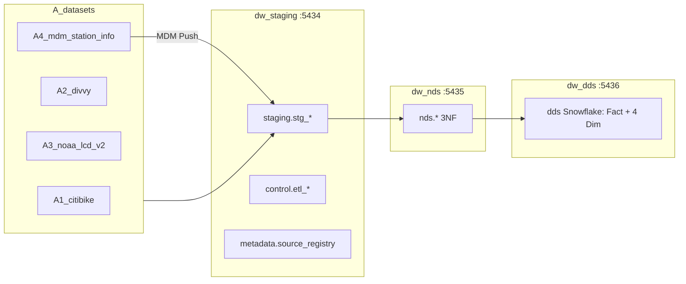
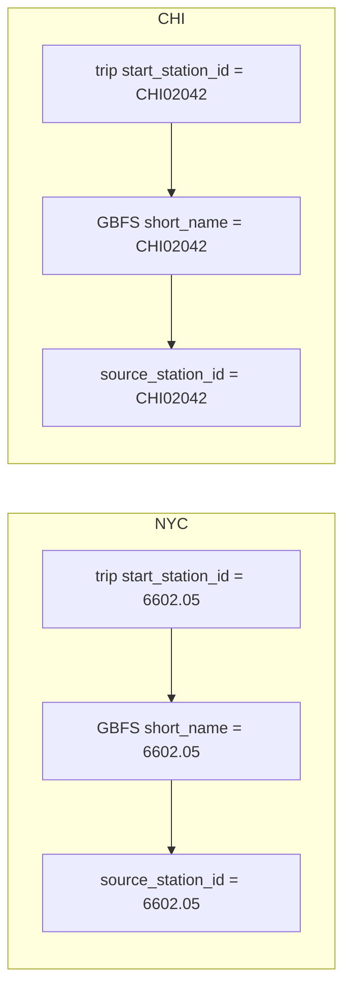
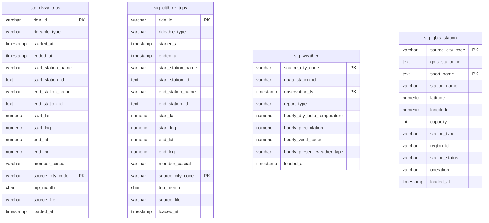
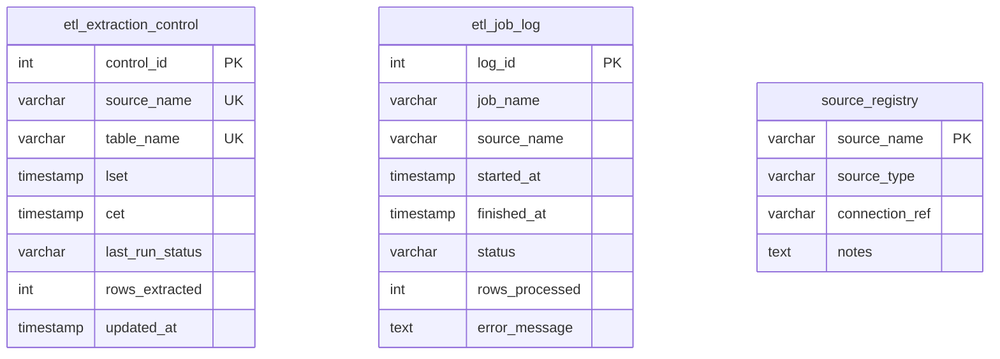
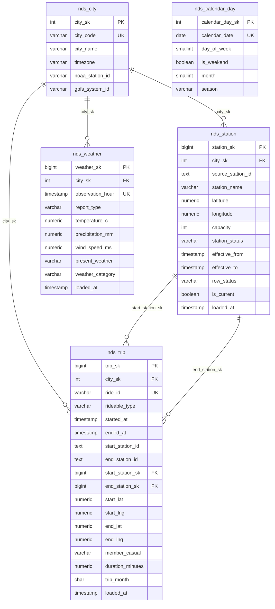
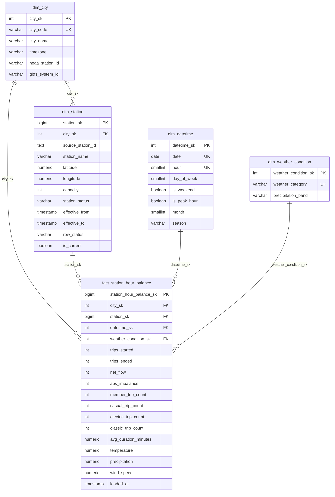

# 4_Official_Hop_Project — Bike-share DW (Hop ETL)

Dự án Apache Hop chính thức cho đề tài **Xây dựng Data Warehouse phân tích dữ liệu để lập kế hoạch điều phối hệ thống xe đạp công cộng tại Chicago và New York**.

**Đối chiếu đề bài:** [official_topic.md](../0_topic_exploration/official_topic.md) · [PDF đăng ký](../0_topic_exploration/official_topic_for_report.pdf)

**Kỳ dữ liệu triển khai:** **01–05/2026** (Divvy, Citi Bike, NOAA LCD v2).

**Kiểm tra URL dataset:** 2026-07-04 (HTTP 200; schema CSV lấy mẫu từ file NCEI thật).

---

## Mục lục

1. [Cấu trúc thư mục](#1-cấu-trúc-thư-mục)
2. [Luồng dữ liệu tóm tắt](#2-luồng-dữ-liệu-tóm-tắt)
3. [Bắt đầu nhanh — tải dữ liệu](#3-bắt-đầu-nhanh--tải-dữ-liệu)
4. [Thành phần theo thư mục](#4-thành-phần-theo-thư-mục)
5. [Cấu hình Hop](#5-cấu-hình-hop)
6. [Trạng thái triển khai](#6-trạng-thái-triển-khai)
7. [A_datasets — Phân tích và hướng dẫn tải](#7-a_datasets--phân-tích-và-hướng-dẫn-tải)
  - [7.1 Tổng quan và cấu trúc](#71-tổng-quan-và-cấu-trúc-a_datasets)
  - [7.2 Divvy (Chicago)](#72-dataset-a2-divvy-trip-data-chicago)
  - [7.3 Citi Bike (NYC)](#73-dataset-a1-citi-bike-trip-histories-nyc)
  - [7.4 NOAA LCD v2](#74-dataset-a3-noaa-lcd-v2)
  - [7.5 GBFS station_information](#75-dataset-a4-gbfs-station_information-mdm)
  - [7.6 Khóa join](#76-khóa-join-giữa-các-nguồn)
  - [7.7 Đối chiếu đề bài](#77-đối-chiếu-yêu-cầu-đề-bài-pdf--official_topicmd)
  - [7.8 Tải và lưu file](#78-tải-và-lưu-file)
  - [7.9 Git và dung lượng](#79-lưu-ý-git-và-dung-lượng)
8. [Schema DW — Staging, NDS, DDS](#8-schema-dw--staging-nds-dds)
  - [8.1 Tổng quan 3 tầng](#81-tổng-quan-3-tầng)
  - [8.1b Khóa join & GBFS mapping](#81b-khóa-join--gbfs-mapping)
  - [8.2 Staging ER](#82-staging-er-4-bảng)
  - [8.3 Control + Metadata](#83-control--metadata)
  - [8.4 NDS 3NF](#84-nds-3nf-5-bảng)
  - [8.5 DDS Snowflake](#85-dds-snowflake-4-dim--1-fact)
  - [8.6 Seed data](#86-seed-data-ddl)
  - [8.7 Khởi chạy PostgreSQL](#87-khởi-chạy-postgresql-local)
  - [8.8 Hop metadata & biến môi trường](#88-hop-metadata--biến-môi-trường)
  - [8.9 Enum / coded fields](#89-enum--coded-fields)

---


## 1. Cấu trúc thư mục

```text
4_Official_Hop_Project/
├── README.md                      # Tài liệu này (master doc — bổ sung dần)
├── Makefile                       # Lệnh nhanh: make datasets-full, make db-up, …
├── development_configs.json       # Biến môi trường Hop
├── project-config.json            # Hop project config
│
├── A_datasets/                    # Trip + NOAA + GBFS (mục 7)
│   ├── download_datasets.sh
│   ├── manifest.json
│   ├── A1_citibike/
│   ├── A2_divvy/
│   ├── A3_noaa_lcd_v2/
│   └── A4_mdm_station_info/
│
├── B_databases/                   # Docker PostgreSQL (STG / NDS / DDS)
│   ├── docker-compose.yml
│   ├── B1_dw_stg_postgresql/
│   ├── B2_dw_nds_postgresql/
│   └── B3_dw_dds_postgresql/
│
├── C_backend/                     # MDM Push (Go)
│   └── C1_mdm_station_info/
│       ├── go.mod
│       ├── main.go
│       └── push_mdm_station_info.go
│
├── D_pipelines/                   # Hop pipelines (.hpl) — nhóm tạo
├── E_workflows/                   # Hop workflows (.hwf) — nhóm tạo
└── metadata/                      # Hop DB + Web Service metadata
    ├── rdbms/                     # dw-staging, dw-control, dw-metadata, dw-nds, dw-dds
    ├── web-service/               # mdm-station.json
    ├── pipeline-run-configuration/
    └── workflow-run-configuration/
```

---


## 2. Luồng dữ liệu tóm tắt

```text
[A4 GBFS Push]  ──► Staging ──► NDS (station) ──► DDS Dim_Station (SCD2)
[A2 Divvy Pull]  ──┐
[A1 Citi Pull]   ──┼──► Staging ──► NDS (trip) ──► aggregate ──► Fact_StationHourBalance
[A3 NOAA Pull]   ──┘         ▲
                               └── join city_code + date_hour (LCD v2 hourly)
```

- **Fact:** `Fact_StationHourBalance` — grain City × Station × Hour (Periodic Snapshot).
- **Pull Staging:** 00:00 GMT+7 (17:00 UTC), LSET/CET theo `official_topic.md`.
- **NOAA:** LCD V2 bulk 2026; ETL dùng file lọc `*_01-05.csv` (metric °C, mm, m/s).

Chi tiết từng nguồn: [mục 7](#7-a_datasets--phân-tích-và-hướng-dẫn-tải).

---

### 2.1 Source Files → StagingDB

Lát cắt ETL đầu tiên triển khai trong `D_pipelines/01_Load_Source_Files_To_Staging/` và `E_workflows/01_load_source_files_to_staging.hwf`: `A_datasets/` là operational landing layer cho JSON/CSV files, Hop đọc file nguồn, chuẩn hóa kiểu dữ liệu, làm sạch giá trị rỗng/trace precipitation, derive `source_city_code`, `trip_month`, rồi upsert vào `dw_staging.staging.*`.

**Nguyên tắc staging cho lát cắt này:**

- CSV trip: đọc recursive `A2_divvy/extracted/{YYYYMM}/*.csv` và `A1_citibike/extracted/{YYYYMM}/*.csv`; giữ `station_id` dạng `TEXT` để không mất mã NYC như `6602.05` hoặc mã CHI như `CHI02042`.
- NOAA LCD v2: đọc hai file `NOAA_LCD_CHICAGO` và `NOAA_LCD_NYC`; chỉ giữ hourly `REPORT_TYPE` dạng `FM-*`, loại daily/monthly summary như `SOD`.
- GBFS JSON: parse `data.stations[*]`, dùng `short_name` làm khóa trạm nghiệp vụ; nếu nguồn thiếu `short_name` thì fallback bằng `gbfs_station_id` để không mất master row, nhưng các dòng fallback này cần được xem là dữ liệu cần review khi join với trip.
- Staging không dùng `batch_id`; audit qua `loaded_at`, `control.etl_extraction_control`, và `control.etl_job_log`. Vì `dw_staging` và `dw_control` là hai database riêng, workflow chạy pipeline `05_audit_staging_load_counts.hpl` sau các load để đọc count từ staging rồi ghi status/count sang control DB.
- Upsert bằng Hop `InsertUpdate` theo business key staging để workflow chạy lại không nhân đôi dữ liệu.

---


## 3. Bắt đầu nhanh — tải dữ liệu

**Windows (CMD / PowerShell / Git Bash):**

1. Cài [Git for Windows](https://git-scm.com/download/win) (có `bash`, `curl`).
2. Cài **Python 3.8+** từ [python.org](https://www.python.org/downloads/) — tick **Add python.exe to PATH**. Kiểm tra: `py -3 --version` hoặc `python --version`.
3. Cài **make** (Chocolatey: `choco install make`) nếu dùng `make datasets-full`.

**Lỗi thường gặp trên CMD:**


| Lỗi                                                       | Cách xử lý                                                                                                                              |
| --------------------------------------------------------- | --------------------------------------------------------------------------------------------------------------------------------------- |
| `WSL execvpe(/bin/bash) failed`                           | Cài Git for Windows; tắt alias `bash.exe` trong Settings → App execution aliases; hoặc mở **Git Bash**                                  |
| `syntax error near unexpected token 'from'`               | Pull bản mới (script tự sửa CRLF); hoặc `sed -i 's/\r$//' A_datasets/download_datasets.sh`                                              |
| `Python was not found` / `Microsoft Store`                | Cài [Python 3](https://www.python.org/downloads/) (tick **Add to PATH**); tắt alias `python.exe` / `python3.exe`; thử `py -3 --version` |
| `End-of-central-directory signature not found` / ZIP hỏng | Pull bản mới; `make datasets-full` tự `--force` tải lại ZIP; hoặc xóa file `.zip` lỗi rồi chạy lại                                      |


**Makefile** (chạy từ `4_Official_Hop_Project/`):

```bash
cd 4_Official_Hop_Project

make help                 # danh sách target
make datasets-check       # validate HTTP URL
make datasets-full        # full pack + ghi đè zip/csv/json + giải nén (Python)
make datasets-status      # manifest + dung lượng từng folder
make db-up                # Docker PostgreSQL STG/NDS/DDS (5434/5435/5436)
make db-status            # kiểm tra container healthy
```

Chi tiết schema DW: [mục 8](#8-schema-dw--staging-nds-dds).

**Windows (không có** `make`**):** mở **Git Bash** trong thư mục project:

```bash
bash A_datasets/download_datasets.sh --urls-only
bash A_datasets/download_datasets.sh --extract --gbfs
```

Một tháng demo (nhẹ hơn ~2.3 GB):

```bash
make datasets-download FROM=202601 TO=202601
```

**Hoặc script trực tiếp** (macOS/Linux/Git Bash — luôn gọi qua `bash`, không cần `chmod`):

```bash
cd A_datasets

bash download_datasets.sh --urls-only          # validate HTTP
bash download_datasets.sh --extract --gbfs     # tải đủ 01–05/2026 (~2.3 GB ZIP; + disk nếu extract)
```

Sau khi chạy, kiểm tra `A_datasets/manifest.json`. Tùy chọn và biến Hop: [mục 7.8](#78-tải-và-lưu-file).

---


## 4. Thành phần theo thư mục


| Thư mục         | Trạng thái | Mô tả                                                                                              |
| --------------- | ---------- | -------------------------------------------------------------------------------------------------- |
| **A_datasets**  | Sẵn sàng   | Script + tài liệu LCD V2, trip 202601–202605 ([mục 7](#7-a_datasets--phân-tích-và-hướng-dẫn-tải))  |
| **B_databases** | Sẵn sàng   | `docker-compose.yml` + init SQL B1/B2/B3; `make db-up` ([mục 8.7](#87-khởi-chạy-postgresql-local)) |
| **C_backend**   | Khung      | Go MDM push GBFS → Hop Web Service (TODO)                                                          |
| **D_pipelines** | Đang triển khai | `01_Load_Source_Files_To_Staging` load JSON/CSV → StagingDB; NDS/DDS load còn TODO             |
| **E_workflows** | Đang triển khai | `01_load_source_files_to_staging.hwf` orchestration cho staging files                          |
| **metadata**    | Sẵn sàng   | RDBMS connections + `mdm-station` web service ([mục 8.8](#88-hop-metadata--biến-môi-trường))       |


---


## 5. Cấu hình Hop


| File                       | Vai trò                                                                                             |
| -------------------------- | --------------------------------------------------------------------------------------------------- |
| `project-config.json`      | `dataSetsCsvFolder` → `${PROJECT_HOME}/A_datasets`                                                  |
| `development_configs.json` | Biến DB (5434/5435/5436), dataset paths, MDM Station — [mục 8.8](#88-hop-metadata--biến-môi-trường) |
| `metadata/rdbms/`          | `dw-staging`, `dw-control`, `dw-metadata`, `dw-nds`, `dw-dds`                                       |
| `metadata/web-service/`    | `mdm-station.json` — Hop Web Service nhận GBFS push                                                 |


Mở project trong Hop GUI: trỏ **Project home** tới thư mục `4_Official_Hop_Project`.

---


## 6. Trạng thái triển khai


| Hạng mục                               | Ghi chú                                                                   |
| -------------------------------------- | ------------------------------------------------------------------------- |
| Ba dataset PDF (Divvy, Citi, NOAA LCD) | Trip + NOAA v2 **2026-01–2026-05** qua `download_datasets.sh`             |
| NOAA LCD v1 → v2                       | V1 deprecated; V2 giữ cùng cột hourly cho Fact table                      |
| GBFS                                   | Tùy chọn `--gbfs`; phục vụ `Dim_Station` Push                             |
| Schema DW (STG / NDS / DDS)            | SQL init + Docker + seed 2026 H1 — [mục 8](#8-schema-dw--staging-nds-dds) |
| Hop metadata (connections + MDM)       | `metadata/rdbms/*.json`, `mdm-station.json`                               |
| Hop ETL Source Files → StagingDB       | Đã có pipeline/workflow đầu tiên — `D_pipelines/01_Load_Source_Files_To_Staging`, `E_workflows/01_load_source_files_to_staging.hwf` |
| Hop ETL end-to-end                     | Chưa hoàn tất — NDS/DDS pipelines còn TODO                                |


---


## 7. A_datasets — Phân tích và hướng dẫn tải

Bổ sung [official_topic.md](../0_topic_exploration/official_topic.md) mục 5: ba nguồn đăng ký (Divvy, Citi Bike, NOAA LCD) + GBFS master (triển khai).

**Kỳ mẫu:** `2026-01` → `2026-05` — trip ZIP theo tháng + NOAA LCD V2 bulk năm 2026 (lọc 01–05 sau tải).

### 7.1. Tổng quan và cấu trúc A_datasets


| Thư mục                | Nguồn              | Vai trò DW                  | Pull/Push       | Grain                 |
| ---------------------- | ------------------ | --------------------------- | --------------- | --------------------- |
| `A1_citibike/`         | Citi Bike trip ZIP | Giao dịch NYC               | Pull (LSET/CET) | 1 dòng / chuyến       |
| `A2_divvy/`            | Divvy trip ZIP     | Giao dịch Chicago           | Pull (LSET/CET) | 1 dòng / chuyến       |
| `A3_noaa_lcd_v2/`      | NOAA LCD v2 CSV    | Thời tiết theo giờ          | Pull (LSET/CET) | 1 dòng / quan sát giờ |
| `A4_mdm_station_info/` | GBFS JSON          | Master trạm (`Dim_Station`) | Push (MDM)      | 1 dòng / trạm         |


```text
A_datasets/
├── download_datasets.sh         # Script tải + lọc NOAA 01–05/2026
├── manifest.json                # Sinh sau khi chạy script
├── .gitignore
├── A1_citibike/
│   ├── 202601-citibike-tripdata.zip
│   ├── … 202605-…
│   └── extracted/202601/        # Tùy chọn (--extract)
├── A2_divvy/
│   ├── 202601-divvy-tripdata.zip
│   └── extracted/202601/
├── A3_noaa_lcd_v2/
│   ├── LCD_USW00014819_2026.csv           # Bulk năm (audit)
│   ├── LCD_USW00014819_2026_01-05.csv     # Dùng cho ETL
│   ├── LCD_USW00094728_2026.csv
│   └── LCD_USW00094728_2026_01-05.csv
└── A4_mdm_station_info/
    ├── divvy_station_information.json     # Tùy chọn (--gbfs)
    └── citibike_station_information.json
```

Nguyên tắc lưu file:

- Giữ **đúng tên file** từ nguồn (ZIP/CSV/JSON).
- **Không** có thư mục `raw/` — mỗi dataset nằm trực tiếp trong `A1_`* … `A4_`*.
- NOAA bulk năm và bản lọc 01–05 cùng thư mục `A3_noaa_lcd_v2/`; Hop ETL đọc file `*_01-05.csv`.


### 7.2. Dataset A2: Divvy Trip Data (Chicago)


| Hạng mục    | Giá trị                                                                  |
| ----------- | ------------------------------------------------------------------------ |
| Trang       | [https://divvybikes.com/system-data](https://divvybikes.com/system-data) |
| S3          | `https://divvy-tripdata.s3.amazonaws.com/{YYYYMM}-divvy-tripdata.zip`    |
| Ví dụ       | `202601-divvy-tripdata.zip` … `202605-divvy-tripdata.zip`                |
| `city_code` | `CHI`                                                                    |


**Header (schema hiện đại, đã kiểm tra):**

```text
ride_id, rideable_type, started_at, ended_at, start_station_name, start_station_id,
end_station_name, end_station_id, start_lat, start_lng, end_lat, end_lng, member_casual
```


| Cột                              | DW / ETL                                               |
| -------------------------------- | ------------------------------------------------------ |
| `started_at`, `ended_at`         | Cắt giờ `America/Chicago`; LSET/CET incremental        |
| `start/end_station_id`           | Join `Dim_Station` qua `source_station_id` + `city_sk` |
| `start/end_lat/lng`              | Fallback tọa độ trạm                                   |
| `rideable_type`, `member_casual` | Measure electric/classic, member/casual                |


**Lưu ý:** Trip CSV **không** có tồn kho xe; `net_flow` suy từ dòng chuyến (PDF/md).

### 7.3. Dataset A1: Citi Bike Trip Histories (NYC)


| Hạng mục    | Giá trị                                                                    |
| ----------- | -------------------------------------------------------------------------- |
| Trang       | [https://citibikenyc.com/system-data](https://citibikenyc.com/system-data) |
| S3          | `https://s3.amazonaws.com/tripdata/{YYYYMM}-citibike-tripdata.zip`         |
| `city_code` | `NYC`                                                                      |


Một ZIP tháng có thể chứa **nhiều** CSV part (`_1.csv` … `_5.csv`); ETL union tất cả sau `--extract`.


| Khác Divvy                                 | Xử lý                              |
| ------------------------------------------ | ---------------------------------- |
| `station_id` dạng số thập phân (`6233.04`) | Cast **text** trước join dim       |
| Dung lượng lớn (~350–900 MB/tháng)         | Đủ disk; tải tuần tự qua script    |
| Namespace `station_id`                     | **Không** join trực tiếp với Divvy |


Timezone trip: `America/New_York`.

### 7.4. Dataset A3: NOAA LCD v2


#### 7.4.1. Vì sao chuyển từ LCD v1 sang v2?


|                         | LCD v1                                                        | LCD v2                                                                                                           |
| ----------------------- | ------------------------------------------------------------- | ---------------------------------------------------------------------------------------------------------------- |
| Trạng thái NCEI         | **Deprecated** — ngừng cập nhật **29/08/2025**                | Sản phẩm hiện hành ([NCEI LCD](https://www.ncei.noaa.gov/products/land-based-station/local-climatological-data)) |
| Nguồn quan sát          | ISD (Integrated Surface Dataset)                              | **GHCN Hourly (GHCNh)** + GHCN Daily                                                                             |
| Bulk URL                | `.../data/local-climatological-data/access/{YEAR}/{725…}.csv` | `.../oa/local-climatological-data/v2/access/{YEAR}/LCD_{GHCND_ID}_{YEAR}.csv`                                    |
| Station ID              | WBAN-style `72534014819`, `72505394728`                       | GHCND `USW00014819`, `USW00094728`                                                                               |
| Đơn vị                  | US customary (°F, inch, …)                                    | **Metric / SI** (°C, mm, m/s)                                                                                    |
| Dữ liệu **2026** hourly | **404** (bulk v1)                                             | **Có** (bulk v2, cập nhật liên tục)                                                                              |


Vẫn thuộc họ **Local Climatological Data (LCD)** — khớp dataset thứ 3 trong [PDF đăng ký](../0_topic_exploration/official_topic_for_report.pdf). Do đó, triển khai dùng **v2 bulk** vì v1 không còn phủ 2026.

#### 7.4.2. Trạm map theo thành phố


| Thành phố | `city_code` | LCD v2 `STATION` | Tên                         | Lat / Lng (file)    | LCD v1 (legacy) |
| --------- | ----------- | ---------------- | --------------------------- | ------------------- | --------------- |
| Chicago   | `CHI`       | `USW00014819`    | CHICAGO MIDWAY AP, IL US    | 41.7842, -87.7553   | `72534014819`   |
| New York  | `NYC`       | `USW00094728`    | NY CITY CENTRAL PARK, NY US | 40.77898, -73.96925 | `72505394728`   |


#### 7.4.3. URL bulk (2026)


| Thành phố    | URL                                                                                                                                                                                              |
| ------------ | ------------------------------------------------------------------------------------------------------------------------------------------------------------------------------------------------ |
| Chicago      | [https://www.ncei.noaa.gov/oa/local-climatological-data/v2/access/2026/LCD_USW00014819_2026.csv](https://www.ncei.noaa.gov/oa/local-climatological-data/v2/access/2026/LCD_USW00014819_2026.csv) |
| NYC          | [https://www.ncei.noaa.gov/oa/local-climatological-data/v2/access/2026/LCD_USW00094728_2026.csv](https://www.ncei.noaa.gov/oa/local-climatological-data/v2/access/2026/LCD_USW00094728_2026.csv) |
| Object Store | [https://www.ncei.noaa.gov/oa/local-climatological-data/index.html#v2/access/2026/](https://www.ncei.noaa.gov/oa/local-climatological-data/index.html#v2/access/2026/)                           |


Pattern: `LCD_{STATION_ID}_{YEAR}.csv`

#### 7.4.4. Cấu trúc file (~125 cột)

- Format: CSV quoted; header giống v1 về **tên cột** chính.
- `DATE`: ISO local `2026-01-01T08:51:00` (giờ quan sát trạm; LST — **không** UTC).
- Một file **cả năm**; mỗi dòng có thể mix cột `Hourly`*,* `Daily`, `Monthly`* (chỉ dùng hourly cho fact grain giờ).

`**REPORT_TYPE` (lọc staging):**


| Giá trị                      | Ý nghĩa                 | Dùng cho fact giờ?                                         |
| ---------------------------- | ----------------------- | ---------------------------------------------------------- |
| `FM-12`, `FM-15`, `FM-16`, … | METAR / quan sát giờ    | **Có** — khi có `HourlyDryBulbTemperature` hoặc precip/gió |
| `SOD`                        | Synoptic Summary of Day | **Không** — grain ngày                                     |
| `SOM`                        | Summary of Month        | **Không**                                                  |


#### 7.4.5. Cột map sang `Fact_StationHourBalance`


| Cột LCD v2                          | Measure / FK trên fact      | Ghi chú                                     |
| ----------------------------------- | --------------------------- | ------------------------------------------- |
| `DATE`                              | `datetime_sk` / `date_hour` | Parse → giờ local theo city                 |
| `HourlyDryBulbTemperature`          | `temperature`               | **°C** (v2); semi-additive AVG              |
| `HourlyPrecipitation`               | `precipitation`             | **mm**; `T` = trace → 0 hoặc NULL (rule DQ) |
| `HourlyWindSpeed`                   | `wind_speed`                | **m/s** (v2)                                |
| `HourlyPresentWeatherType` + precip | `weather_condition_sk`      | Rule ETL → Clear / Rain / Snow / Fog        |
| `LATITUDE`, `LONGITUDE`             | Không lên fact              | Join qua `city_code`                        |


#### 7.4.6. Lọc 01–05/2026 (script)

1. Tải bulk → `A3_noaa_lcd_v2/LCD_*_2026.csv`.
2. Sinh `*_01-05.csv`: giữ mọi dòng có `DATE` từ `2026-01-01` đến `2026-05-31`.

Hop Pull / staging đọc file **filtered** để đồng bộ với trip `202601`–`202605`.

#### 7.4.7. Thách thức ETL (v2)

- **Đơn vị metric** — ghi rõ trong metadata staging nếu so sánh với tài liệu cũ viết theo v1.
- **Nhiều dòng / giờ** — dedup theo `(STATION, date_hour)` (ưu tiên `FM-15`/`FM-16`).
- **Giá trị rỗng** — precip/wind có thể blank; không coi là 0 trừ khi rule DQ quy định.
- **Trạm đại diện đô thị** — sân bay / công viên; chấp nhận cho môn học.


#### 7.4.8. So sánh nhanh v1 vs v2 (NYC)


|                      | v1 (2025)                 | v2 (2026)      |
| -------------------- | ------------------------- | -------------- |
| Nhiệt độ mẫu tháng 1 | ~46 °F                    | ~0.6 °C        |
| Station column       | `72505394728`             | `USW00094728`  |
| Join key với trip    | `city_code` + `date_hour` | **Giữ nguyên** |


### 7.5. Dataset A4: GBFS station_information (MDM)


| Hạng mục  | Giá trị                                                                                                                          |
| --------- | -------------------------------------------------------------------------------------------------------------------------------- |
| Vai trò   | Push MDM → `Dim_Station` (SCD2); **không** trong bảng 3 dataset PDF                                                              |
| Divvy     | [https://gbfs.lyft.com/gbfs/2.3/chi/en/station_information.json](https://gbfs.lyft.com/gbfs/2.3/chi/en/station_information.json) |
| Citi Bike | [https://gbfs.citibikenyc.com/gbfs/en/station_information.json](https://gbfs.citibikenyc.com/gbfs/en/station_information.json)   |
| Khóa      | `city_sk` + `source_station_id`                                                                                                  |


Tải bằng `./download_datasets.sh --gbfs`.

### 7.6. Khóa join giữa các nguồn

**Nguyên tắc:** `station_id` trong trip **chỉ có nghĩa trong một thành phố** — không join Divvy ↔ Citi Bike theo `station_id`. So sánh Chicago vs NYC: union fact + slice theo `Dim_City` / `city_sk`.

**Khóa trạm thống nhất (Staging → NDS → DDS):** `(city_sk, source_station_id)` — `source_station_id` = GBFS `short_name` = trip `start/end_station_id` (cast **TEXT**).


| Cặp                         | Khóa join                       | Ghi chú                                                               |
| --------------------------- | ------------------------------- | --------------------------------------------------------------------- |
| Divvy ↔ Citi Bike           | `city_sk` only                  | Union fact; **không** join `station_id` cross-city                    |
| Trip ↔ GBFS / `Dim_Station` | `city_sk` + `source_station_id` | `source_station_id` ← GBFS `short_name` = trip `start/end_station_id` |
| Trip ↔ NOAA v2              | `city_code` + `date_hour` local | CHI ↔ `USW00014819`; NYC ↔ `USW00094728`                              |
| NYC trip ↔ GBFS             | trip `6602.05` = `short_name`   | Không dùng GBFS `station_id` (UUID/số dài)                            |
| CHI trip ↔ GBFS             | trip `CHI02042` = `short_name`  | Cùng rule, format khác NYC                                            |


**Staging upsert (không** `batch_id`**):** audit qua `loaded_at` + `control.etl_extraction_control` (LSET/CET) + `control.etl_job_log`.


| Bảng staging                             | Business key upsert                  |
| ---------------------------------------- | ------------------------------------ |
| `stg_divvy_trips` / `stg_citibike_trips` | `(source_city_code, ride_id)`        |
| `stg_weather`                            | `(source_city_code, observation_ts)` |
| `stg_gbfs_station`                       | `(source_city_code, short_name)`     |


**Phân tích lịch:** không dùng `Dim_Holiday` — weekday/weekend qua `Dim_DateTime.is_weekend` (và `nds.calendar_day`).

**Cửa sổ đồng bộ:** trip `202601`–`202605` + NOAA filtered `*_01-05.csv` (cùng năm 2026).

### 7.7. Đối chiếu yêu cầu đề bài (PDF / official_topic.md)


| Yêu cầu đề bài                                                                      | LCD v2 + trip 01–05/2026                        |
| ----------------------------------------------------------------------------------- | ----------------------------------------------- |
| Dataset 3: NOAA NCEI **Local Climatological Data**                                  | **Đáp ứng** (v2 cùng sản phẩm LCD)              |
| Pull theo giờ: `HourlyDryBulbTemperature`, `HourlyPrecipitation`, `HourlyWindSpeed` | **Có**                                          |
| Join `city_code` + `date_hour`                                                      | **Có**                                          |
| Fact grain City × Station × Hour                                                    | Trip aggregate + weather denormalize theo giờ   |
| `Dim_WeatherCondition` (Clear/Rain/Snow)                                            | Rule ETL từ precip + `HourlyPresentWeatherType` |
| Phân tích tuần / cuối tuần (`is_weekend`)                                           | Lịch **2026**; weather **2026 thật**            |
| KPI `Weather_Sensitivity_Score`                                                     | **Hợp lệ** với quan sát thật                    |
| Chicago + NYC so sánh công bằng                                                     | Cùng kỳ 5 tháng 2026                            |


### 7.8. Tải và lưu file

**Makefile** (từ `4_Official_Hop_Project/`):

```bash
make datasets-check
make datasets-download              # trip + NOAA, không extract
make datasets-full                  # trip + NOAA + --extract + --gbfs
make datasets-noaa
make datasets-status
make datasets-download FROM=202603 TO=202604
make db-up                          # Docker STG/NDS/DDS
make db-down
make db-status
```

**Script (**`A_datasets/download_datasets.sh`**):**

```bash
cd 4_Official_Hop_Project/A_datasets

bash download_datasets.sh --urls-only          # validate HTTP
bash download_datasets.sh                        # tải trip 202601–202605 + NOAA v2 + lọc 01–05
bash download_datasets.sh --extract              # thêm giải nén trip CSV
bash download_datasets.sh --gbfs                 # thêm GBFS station_information
bash download_datasets.sh --noaa-only            # chỉ NOAA
bash download_datasets.sh --from 202603 --to 202604
```

**Biến Hop** (`development_configs.json`):


| Nhóm         | Biến chính                                                 | Ghi chú                                          |
| ------------ | ---------------------------------------------------------- | ------------------------------------------------ |
| Dataset      | `RAW_DATASET_ROOT`, `DATASETS_CSV_FOLDER`, `SAMPLE_PERIOD` | Root `A_datasets`                                |
| Trip         | `DIVVY_TRIPS_DIR`, `CITIBIKE_TRIPS_DIR`                    | Thư mục `extracted/{YYYYMM}/`                    |
| NOAA         | `NOAA_LCD_DIR`, `NOAA_LCD_CHICAGO`, `NOAA_LCD_NYC`         | File `*_01-05.csv`                               |
| GBFS / MDM   | `GBFS_STATION_DIR`, `HOP_MDM_STATION_STAGING_TABLE`        | Push → `stg_gbfs_station`                        |
| DB STG       | `STAGING_DB_*`, `CONTROL_DB_*`, `METADATA_DB_*`            | Port **5434**                                    |
| DB NDS / DDS | `NDS_DB_*` (5435), `DDS_DB_*` (5436)                       | User `*_user`, password `*@123`                  |
| Power BI     | `POWERBI_DDS_*`                                            | `analytics_reader_user` / `analytics_reader@123` |


Chi tiết MDM + metadata: [mục 8.8](#88-hop-metadata--biến-môi-trường).

### 7.9. Lưu ý Git và dung lượng


| Nguồn                     | Ước tính (01–05/2026) |
| ------------------------- | --------------------- |
| Divvy ZIP (5 tháng)       | ~70 MB                |
| Citi Bike ZIP (5 tháng)   | ~2.2 GB               |
| NOAA v2 filtered (2 file) | ~6–7 MB               |
| **Tổng**                  | **~2.3 GB**           |


File lớn **gitignore**; mỗi thành viên chạy `download_datasets.sh` local.

---


## 8. Schema DW — Staging, NDS, DDS

Thiết kế schema cho bike-share DW (Chicago Divvy + NYC Citi Bike, kỳ mẫu **202601–202605**). SQL init: `B_databases/`; Docker: `make db-up` (ports **5434** STG+Control+Metadata, **5435** NDS, **5436** DDS).

### 8.1. Tổng quan 3 tầng

- **4 dimensions** (không `Dim_Holiday`): `Dim_City`, `Dim_Station`, `Dim_DateTime`, `Dim_WeatherCondition`.
- **1 fact:** `Fact_StationHourBalance` — Periodic Snapshot, grain **City × Station × Hour**.
- **DDS layout:** **Snowflake schema** — `dim_station.city_sk` → `dim_city` (hierarchy City → Station); fact FK trực tiếp tới cả `city_sk` và `station_sk`.
- **Không** `batch_id` trên staging — chỉ `loaded_at`; upsert theo business key.

**Source mapping:**


| A_datasets path                        | Staging              | NDS           | DDS                                   |
| -------------------------------------- | -------------------- | ------------- | ------------------------------------- |
| `A2_divvy/extracted/{YYYYMM}/*.csv`    | `stg_divvy_trips`    | `nds.trip`    | aggregate → `Fact_StationHourBalance` |
| `A1_citibike/extracted/{YYYYMM}/*.csv` | `stg_citibike_trips` | `nds.trip`    | same                                  |
| `A3_noaa_lcd_v2/LCD_*_01-05.csv`       | `stg_weather`        | `nds.weather` | measures + `Dim_WeatherCondition`     |
| `A4_mdm_station_info/*.json`           | `stg_gbfs_station`   | `nds.station` | `Dim_Station` (SCD2)                  |





**Ghi chú thiết kế:**

- Không `Dim_Holiday` / `holiday_sk` — weekday/weekend qua `Dim_DateTime.is_weekend`.
- Không `batch_id` — upsert staging + audit qua `loaded_at` + control tables.
- **Station join:** `(city_sk, source_station_id)`; trip id = GBFS `short_name`; không cross-city; cast TEXT.
- NOAA: `city_code` + `date_hour_local`; ưu tiên `REPORT_TYPE = 'FM-15'`; đơn vị v2 **°C, mm, m/s**.


### 8.1b. Khóa join & GBFS mapping


| Cặp                         | Khóa join                       | Ghi chú                                                               |
| --------------------------- | ------------------------------- | --------------------------------------------------------------------- |
| Divvy ↔ Citi Bike           | `city_sk` only                  | Union fact; **không** join `station_id` cross-city                    |
| Trip ↔ GBFS / `Dim_Station` | `city_sk` + `source_station_id` | `source_station_id` ← GBFS `short_name` = trip `start/end_station_id` |
| Trip ↔ NOAA                 | `city_code` + `date_hour` local | CHI ↔ `USW00014819`; NYC ↔ `USW00094728`                              |
| NYC trip ↔ GBFS             | trip `6602.05` = `short_name`   | Không dùng GBFS `station_id` (UUID/số dài)                            |
| CHI trip ↔ GBFS             | trip `CHI02042` = `short_name`  | Cùng rule, format khác NYC                                            |





### 8.2. Staging ER (`staging.*` — 4 bảng)

Port **5434** · SQL: `B1_dw_stg_postgresql/02_staging_schema.sql`

Audit: `loaded_at` only — không `batch_id`. Enum values: [§8.9](#89-enum--coded-fields).

`stg_divvy_trips` và `stg_citibike_trips` cùng cấu trúc (14 cột CSV + audit); khác `DEFAULT source_city_code` (`CHI` vs `NYC`).




| Bảng                         | PK / upsert key                      | Ghi chú                                               |
| ---------------------------- | ------------------------------------ | ----------------------------------------------------- |
| `staging.stg_divvy_trips`    | `(source_city_code, ride_id)`        | 14 cột CSV + `trip_month`, `source_file`, `loaded_at` |
| `staging.stg_citibike_trips` | `(source_city_code, ride_id)`        | Union multi-part CSV                                  |
| `staging.stg_weather`        | `(source_city_code, observation_ts)` | NOAA LCD v2 hourly, metric                            |
| `staging.stg_gbfs_station`   | `(source_city_code, short_name)`     | `short_name` → `source_station_id` khi load NDS/DDS   |


### 8.3. Control + Metadata (`control.*`, `metadata.*`)

Port **5434** · SQL: `B1_dw_stg_postgresql/03_control_schema.sql`, `04_metadata_schema.sql`




| Schema     | Bảng                     | PK / UK                                      | Ghi chú                                                               |
| ---------- | ------------------------ | -------------------------------------------- | --------------------------------------------------------------------- |
| `control`  | `etl_extraction_control` | `control_id`; UK `(source_name, table_name)` | LSET/CET: `divvy_trips`, `citibike_trips`, `noaa_lcd`, `gbfs_station` |
| `control`  | `etl_job_log`            | `log_id`                                     | Audit từng lần chạy workflow/pipeline                                 |
| `metadata` | `source_registry`        | `source_name`                                | `source_type`, `connection_ref`, `notes`                              |


### 8.4. NDS 3NF (`nds.*` — 5 bảng)

Port **5435** · SQL: `B2_dw_nds_postgresql/02_nds_schema.sql`




| Bảng               | PK                                 | Ghi chú                                                                                     |
| ------------------ | ---------------------------------- | ------------------------------------------------------------------------------------------- |
| `nds.city`         | `city_sk`                          | CHI, NYC; timezone, NOAA v2 id                                                              |
| `nds.station`      | `station_sk`                       | UNIQUE `(city_sk, source_station_id)` per SCD2 row; `source_station_id` = GBFS `short_name` |
| `nds.calendar_day` | `calendar_day_sk`                  | `is_weekend`, `season` — thay vai trò phân tích calendar                                    |
| `nds.weather`      | `weather_sk`                       | UNIQUE `(city_sk, observation_hour)`                                                        |
| `nds.trip`         | `trip_sk`; UK `(city_sk, ride_id)` | FK `start_station_sk`, `end_station_sk` → `nds.station`                                     |


`nds.calendar_day` độc lập (không FK sang `trip`/`weather`); join phân tích qua `calendar_date` ↔ `started_at` / `observation_hour`.

### 8.5. DDS Snowflake (`dds.*` — 4 Dim + 1 Fact)

- Port **5436** · SQL: `B3_dw_dds_postgresql/02_dds_schema.sql`
- **Schema type:** **Snowflake** (không phải Star thuần) — dimension có hierarchy: `dim_station` FK `city_sk` → `dim_city` (City → Station). Các dimension còn lại (`dim_datetime`, `dim_weather_condition`) nối trực tiếp fact; không có hierarchy bổ sung.
- **Fact type:** Periodic Snapshot
- **Fact Grain:** City × Station × Hour
- **Unique Key in Fact table:** `(city_sk, station_sk, datetime_sk)`




| Dimension                   | SCD        | Hierarchy / ghi chú                                 |
| --------------------------- | ---------- | --------------------------------------------------- |
| `dds.dim_city`              | Type 1     | Cấp trên của `dim_station` (snowflake arm)          |
| `dds.dim_station`           | **Type 2** | FK `city_sk` → `dim_city`; `source_station_id` TEXT |
| `dds.dim_datetime`          | None       | Phẳng — nối trực tiếp fact                          |
| `dds.dim_weather_condition` | Type 1     | Phẳng — nối trực tiếp fact                          |


**Không có** `holiday_sk` trên fact (quyết định nhóm — dùng `dim_datetime.is_weekend`).

### 8.6. Seed data (DDL)


| Đối tượng                   | Nội dung seed                                                       |
| --------------------------- | ------------------------------------------------------------------- |
| `dds.dim_city`              | CHI + NYC                                                           |
| `dds.dim_weather_condition` | Clear, Rain, Snow, Fog                                              |
| `dds.dim_datetime`          | Mọi giờ **2026-01-01 → 2026-05-31** + `is_weekend` + `is_peak_hour` |
| `nds.city`                  | CHI + NYC (mirror) — `B2_dw_nds_postgresql/03_seed_nds.sql`         |
| `nds.calendar_day`          | Mọi ngày 2026-01-01 → 2026-05-31                                    |


**Không seed** US federal holidays.

### 8.7. Khởi chạy PostgreSQL local

```bash
cd 4_Official_Hop_Project
make db-up          # docker compose up -d (B_databases/)
make db-status      # kiểm tra 3 container healthy
make db-down        # dừng containers
```


| Service           | Port | Databases                                 |
| ----------------- | ---- | ----------------------------------------- |
| `dw-stg-postgres` | 5434 | `dw_staging`, `dw_control`, `dw_metadata` |
| `dw-nds-postgres` | 5435 | `dw_nds`                                  |
| `dw-dds-postgres` | 5436 | `dw_dds`                                  |


### 8.8. Hop metadata & biến môi trường

**Metadata** (`metadata/`):

```text
metadata/
├── rdbms/dw-staging.json, dw-control.json, dw-metadata.json, dw-nds.json, dw-dds.json
├── web-service/mdm-station.json
├── workflow-run-configuration/local.json
└── pipeline-run-configuration/local.json
```

**MDM Station** (theo pattern `3_Hop_ETL_Test` — retry/timeout do Backend quản lý, không khai báo trong Hop):


| Biến                            | Giá trị dev                                      | Ghi chú                                      |
| ------------------------------- | ------------------------------------------------ | -------------------------------------------- |
| `HOP_MDM_API_HOST`              | `127.0.0.1`                                      | Bind host Hop Server                         |
| `HOP_MDM_API_PORT`              | `8080`                                           |                                              |
| `HOP_MDM_API_URL`               | `http://localhost:8080/hop/webService/?service=` | Nối `HOP_MDM_STATION_SERVICE_ID`             |
| `HOP_MDM_STATION_API_KEY`       | `local-dev-mdm-key`                              | Header `X-API-Key`                           |
| `HOP_MDM_STATION_SERVICE_ID`    | `mdm-station`                                    | Khớp `metadata/web-service/mdm-station.json` |
| `HOP_MDM_STATION_STAGING_TABLE` | `stg_gbfs_station`                               | Bảng staging sau push                        |
| `HOP_MDM_ALLOWED_OPERATIONS`    | `INSERT,UPDATE,DELETE`                           |                                              |


**DB credentials** (local dev — khớp SQL init `B_databases/`):


| Layer    | User                    | Password               |
| -------- | ----------------------- | ---------------------- |
| Staging  | `hop_staging_user`      | `hop_staging@123`      |
| Control  | `hop_control_user`      | `hop_control@123`      |
| Metadata | `hop_metadata_user`     | `hop_metadata@123`     |
| NDS      | `hop_nds_user`          | `hop_nds@123`          |
| DDS      | `hop_dds_user`          | `hop_dds@123`          |
| Power BI | `analytics_reader_user` | `analytics_reader@123` |


### 8.9. Enum / coded fields

Các cột dưới đây dùng `VARCHAR` (không phải PostgreSQL `ENUM`). Giá trị hợp lệ được ghi trong SQL (`B_databases/*/05_enum_field_notes.sql` hoặc `04_enum_field_notes.sql`) qua `COMMENT ON COLUMN`.

#### Staging (`staging.*`)


| Bảng / cột                          | Giá trị hợp lệ                                        | Ghi chú                                 |
| ----------------------------------- | ----------------------------------------------------- | --------------------------------------- |
| `stg_*_trips.source_city_code`      | `CHI`, `NYC`                                          | Khớp `city_code` mọi tầng               |
| `stg_*_trips.rideable_type`         | `classic_bike`, `electric_bike`                       | Từ trip CSV                             |
| `stg_*_trips.member_casual`         | `member`, `casual`                                    | Từ trip CSV                             |
| `stg_weather.source_city_code`      | `CHI`, `NYC`                                          |                                         |
| `stg_weather.report_type`           | `FM-15`, `FM-16`, `FM-12` (hourly); loại `SOD`, `SOM` | ETL ưu tiên `FM-15`                     |
| `stg_gbfs_station.source_city_code` | `CHI`, `NYC`                                          |                                         |
| `stg_gbfs_station.station_type`     | `classic`, `e_bike` (tùy GBFS; có thể NULL)           |                                         |
| `stg_gbfs_station.station_status`   | `open`, `closed`, `maintenance`                       | DW normalized; mặc định `open`          |
| `stg_gbfs_station.operation`        | `INSERT`, `UPDATE`, `DELETE`                          | MDM push (`HOP_MDM_ALLOWED_OPERATIONS`) |


#### Control + Metadata


| Bảng / cột                               | Giá trị hợp lệ                                              |
| ---------------------------------------- | ----------------------------------------------------------- |
| `etl_extraction_control.source_name`     | `divvy_trips`, `citibike_trips`, `noaa_lcd`, `gbfs_station` |
| `etl_extraction_control.last_run_status` | `SUCCESS`, `FAILED`, `RUNNING`, `SKIPPED`                   |
| `etl_job_log.status`                     | `SUCCESS`, `FAILED`, `RUNNING`, `SKIPPED`                   |
| `source_registry.source_type`            | `s3_csv`, `file_pull`, `json_push`                          |


#### NDS (`nds.*`)


| Bảng / cột                 | Giá trị hợp lệ                       | Ghi chú                                                                                                     |
| -------------------------- | ------------------------------------ | ----------------------------------------------------------------------------------------------------------- |
| `city.city_code`           | `CHI`, `NYC`                         |                                                                                                             |
| `city.gbfs_system_id`      | `divvy`, `citibike`                  |                                                                                                             |
| `station.station_status`   | `open`, `closed`, `maintenance`      | Ví dụ: trạm đang mở vs tạm đóng                                                                             |
| `station.row_status`       | `active`, `deleted`                  | SCD2 — `active` = phiên bản hiện tại                                                                        |
| `calendar_day.day_of_week` | `1`–`7`                              | ISO: 1=Thứ Hai … 7=Chủ Nhật                                                                                 |
| `calendar_day.season`      | `winter`, `spring`, `summer`, `fall` | Theo tháng Bắc bán cầu: T12–T2 / T3–T5 / T6–T8 / T9–T11. Kỳ mẫu 202601–202605 chỉ có **winter**, **spring** |
| `weather.report_type`      | `FM-15`, `FM-16`, `FM-12`            | Giống staging                                                                                               |
| `weather.weather_category` | `Clear`, `Rain`, `Snow`, `Fog`       | Rule ETL từ precip + present weather                                                                        |
| `trip.rideable_type`       | `classic_bike`, `electric_bike`      |                                                                                                             |
| `trip.member_casual`       | `member`, `casual`                   |                                                                                                             |


#### DDS (`dds.*`)


| Bảng / cột                                 | Giá trị hợp lệ                       | Ghi chú                                       |
| ------------------------------------------ | ------------------------------------ | --------------------------------------------- |
| `dim_city.city_code`                       | `CHI`, `NYC`                         |                                               |
| `dim_city.gbfs_system_id`                  | `divvy`, `citibike`                  |                                               |
| `dim_station.station_status`               | `open`, `closed`, `maintenance`      | Giống `nds.station`                           |
| `dim_station.row_status`                   | `active`, `deleted`                  | SCD2                                          |
| `dim_datetime.day_of_week`                 | `1`–`7`                              | ISO                                           |
| `dim_datetime.hour`                        | `0`–`23`                             | Giờ local                                     |
| `dim_datetime.month`                       | `1`–`12`                             |                                               |
| `dim_datetime.season`                      | `winter`, `spring`, `summer`, `fall` | Cùng rule `calendar_day.season`               |
| `dim_datetime.is_peak_hour`                | `TRUE`, `FALSE`                      | `TRUE` = ngày thường (T2–T6) giờ 7, 8, 17, 18 |
| `dim_weather_condition.weather_category`   | `Clear`, `Rain`, `Snow`, `Fog`       | Seed cố định                                  |
| `dim_weather_condition.precipitation_band` | `none`, `light_moderate`, `snow`     | Seed cố định                                  |


**Ví dụ** `season` **(seed** `03_seed_dimensions.sql`**):**


| Tháng     | `season` |
| --------- | -------- |
| 12, 1, 2  | `winter` |
| 3, 4, 5   | `spring` |
| 6, 7, 8   | `summer` |
| 9, 10, 11 | `fall`   |


---

*HCMUS Master IS — Advanced Business Intelligence — Nhóm 8.*
